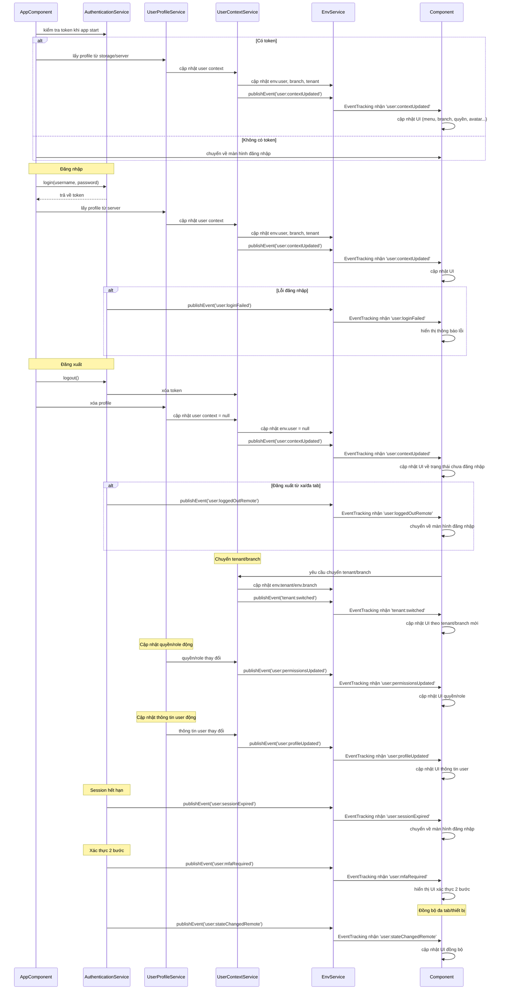

# Flow hoàn chỉnh với các event nâng cao

# Bổ sung event và luồng nâng cao

- Event cho quyền/role động, cập nhật thông tin user, session hết hạn, xác thực 2 bước, đồng bộ đa tab/thiết bị, chuyển tenant/branch.
- Component luôn subscribe các event này để cập nhật UI đúng trạng thái.
- Đảm bảo đồng bộ đa tab, đa thiết bị, realtime UI.
