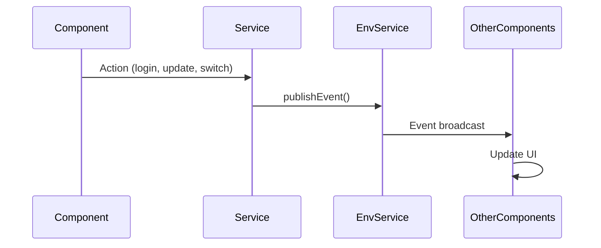

# 🚀 **USER PROFILE FLOW IMPLEMENTATION**

## 📋 **OVERVIEW**

Đã implement đầy đủ user profile flow theo tài liệu architecture với các tính năng:

- ✅ **Authentication Events**: Login, logout, session expired, MFA
- ✅ **User Context Events**: Profile updates, permissions, roles
- ✅ **Tenant/Branch Events**: Switching, context updates
- ✅ **Remote Sync Events**: Multi-tab, multi-device synchronization
- ✅ **Error Handling Events**: Auth errors, access denied, rate limiting

## 🏗️ **ARCHITECTURE IMPLEMENTED**

### **1. Event-Driven Architecture**
```typescript
// Centralized event codes
import { EVENT_CODES } from '../static/event-codes';

// Example usage
this.env.publishEvent({ 
  Code: EVENT_CODES.USER.CONTEXT_UPDATED, 
  data: userData 
});
```

### **2. Service Layer**
- **AuthenticationService**: JWT tokens, session management, MFA
- **UserProfileService**: Profile CRUD, permissions, roles
- **UserContextService**: Context management, tenant switching
- **EnvService**: Event publishing, storage management

### **3. Event Flow**


## 🔧 **IMPLEMENTATION DETAILS**

### **Authentication Events**

#### **Login Flow**
```typescript
// AuthenticationService.login()
async login(credentials: LoginCredentials): Promise<AuthResult> {
  try {
    // ... authentication logic ...
    
    // Publish success event
    this.env.publishEvent({ 
      Code: EVENT_CODES.USER.CONTEXT_UPDATED, 
      data: authResult 
    });
    
    return authResult;
  } catch (error) {
    // Publish failure event
    this.env.publishEvent({ 
      Code: EVENT_CODES.USER.LOGIN_FAILED, 
      data: error 
    });
    throw error;
  }
}
```

#### **Session Management**
```typescript
// Automatic session monitoring
private setupSessionMonitoring(): void {
  setInterval(() => {
    if (this.isAuthenticated()) {
      const lastActivity = this.getLastActivity();
      const sessionTimeout = this.getSessionTimeout();
      
      if (Date.now() - lastActivity > sessionTimeout) {
        this.env.publishEvent({ Code: EVENT_CODES.USER.SESSION_EXPIRED });
        this.logout();
      }
    }
  }, 60000); // Check every minute
}
```

#### **MFA Support**
```typescript
// Multi-factor authentication
async loginWithMFA(credentials: LoginCredentials, mfaCode: string): Promise<AuthResult> {
  try {
    const mfaChallenge = await this.getMFAChallenge(credentials);
    const authResult = await this.verifyMFACode(mfaChallenge, mfaCode);
    
    if (authResult.requiresMfa) {
      this.env.publishEvent({ Code: EVENT_CODES.USER.MFA_REQUIRED, data: mfaChallenge });
    }
    
    return authResult;
  } catch (error) {
    this.handleAuthError(error, 'mfa_login');
    throw error;
  }
}
```

### **User Context Events**

#### **Profile Updates**
```typescript
// UserProfileService.updateProfile()
async updateProfile(profile: Partial<UserProfile>): Promise<UserProfile> {
  try {
    const currentProfile = await this.loadSavedProfile();
    const updatedProfile = { ...currentProfile, ...profile };
    
    await this.setProfile(updatedProfile);
    this.userProfile$.next(updatedProfile);
    
    // Publish event
    this.env.publishEvent({ 
      Code: EVENT_CODES.USER.PROFILE_UPDATED, 
      data: updatedProfile 
    });
    
    return updatedProfile;
  } catch (error) {
    throw error;
  }
}
```

#### **Permission Updates**
```typescript
// UserProfileService.updateUserPermissions()
async updateUserPermissions(permissions: Permission[]): Promise<void> {
  try {
    const currentProfile = await this.loadSavedProfile();
    if (currentProfile) {
      currentProfile.Permissions = permissions;
      await this.setProfile(currentProfile);
      
      // Publish event
      this.env.publishEvent({ 
        Code: EVENT_CODES.USER.PERMISSIONS_UPDATED, 
        data: permissions 
      });
    }
  } catch (error) {
    throw error;
  }
}
```

### **Tenant/Branch Events**

#### **Branch Switching**
```typescript
// UserContextService.switchBranch()
async switchBranch(branchId: string): Promise<void> {
  try {
    const newBranch = await this.loadBranchData(branchId);
    if (!newBranch) {
      throw new Error(`Branch ${branchId} not found`);
    }
    
    // Update branch context
    this.env.selectedBranch = newBranch;
    
    // Publish event
    this.env.publishEvent({ 
      Code: EVENT_CODES.TENANT.BRANCH_SWITCHED, 
      data: newBranch 
    });
    
  } catch (error) {
    throw error;
  }
}
```

### **Remote Sync Events**

#### **Multi-Tab Synchronization**
```typescript
// AuthenticationService.setupMultiTabSync()
private setupMultiTabSync(): void {
  if (typeof window !== 'undefined') {
    window.addEventListener('storage', (event) => {
      if (event.key === 'UserToken' || event.key === 'UserProfile') {
        this.env.publishEvent({ 
          Code: EVENT_CODES.USER.STATE_CHANGED_REMOTE, 
          data: { 
            key: event.key, 
            newValue: event.newValue, 
            oldValue: event.oldValue 
          } 
        });
      }
    });
  }
}
```

#### **Remote Logout Detection**
```typescript
// AuthenticationService.setupRemoteLogoutDetection()
private setupRemoteLogoutDetection(): void {
  setInterval(async () => {
    if (this.isAuthenticated()) {
      try {
        await this.validateTokenWithServer();
      } catch (error: any) {
        if (error.status === 401) {
          this.env.publishEvent({ Code: EVENT_CODES.USER.LOGGED_OUT_REMOTE });
          this.logout();
        }
      }
    }
  }, 30000); // Check every 30 seconds
}
```

## 🎯 **COMPONENT INTEGRATION**

### **AppComponent Event Handling**
```typescript
// Setup event handlers
private setupEventHandlers(): void {
  this.env.getEvents().subscribe((data) => {
    switch (data.Code) {
      case EVENT_CODES.USER.CONTEXT_UPDATED:
        this.loadPinnedMenu();
        this.loadNotifications();
        this.updateStatusbar();
        break;
        
      case EVENT_CODES.USER.SESSION_EXPIRED:
        this.env.showMessage('Phiên đăng nhập đã hết hạn', 'danger');
        this.router.navigateByUrl('/login');
        break;
        
      case EVENT_CODES.USER.MFA_REQUIRED:
        this.env.showMessage('Yêu cầu xác thực 2 bước', 'warning');
        // TODO: Show MFA UI
        break;
        
      case EVENT_CODES.TENANT.BRANCH_SWITCHED:
        this.handleBranchSwitch(data.data);
        break;
        
      // ... other events
    }
  });
}
```

### **PageBase Event Handling**
```typescript
// Automatic data reload on user events
this.subscriptions.push(
  this.env.getEvents().subscribe((data) => {
    if ([
      EVENT_CODES.USER.CONTEXT_UPDATED,
      EVENT_CODES.USER.PERMISSIONS_UPDATED,
      EVENT_CODES.USER.PROFILE_UPDATED,
      EVENT_CODES.USER.ROLES_UPDATED,
      EVENT_CODES.TENANT.SWITCHED,
      EVENT_CODES.TENANT.BRANCH_SWITCHED,
      // ... other events
    ].includes(data.Code)) {
      // Automatically reload data when user/tenant/permission/profile changes
      this.preLoadData(null);
    }
  })
);
```

## 🔒 **SECURITY FEATURES**

### **Token Validation**
- Automatic token refresh
- Server-side token validation
- Session timeout monitoring
- Remote logout detection

### **Error Handling**
- Centralized error events
- Context-aware error messages
- Automatic logout on security violations
- Rate limiting protection

### **Multi-Factor Authentication**
- TOTP support
- SMS/Email verification
- Challenge-response flow
- Remember device option

## 📱 **MOBILE SUPPORT**

### **Device Registration**
```typescript
// Automatic device registration for mobile
private async registerDevice(deviceInfo: DeviceInfo): Promise<void> {
  try {
    if (!this.env.user?.Id) return;
    
    deviceInfo.IDUser = this.env.user.Id;
    const platform = Capacitor.getPlatform();
    
    if (['mobile', 'tablet', 'ios', 'android'].includes(platform)) {
      await PushNotifications.register();
      
      PushNotifications.addListener('registration', (token: Token) => {
        this.env.setStorage('NotifyToken', token.value);
        deviceInfo.NotifyToken = token.value;
      });
    }
  } catch (error) {
    console.error('Device registration error:', error);
  }
}
```

### **Push Notifications**
- Automatic token management
- Platform-specific handling
- User association

## 🧪 **TESTING & VALIDATION**

### **Event Testing**
```typescript
// Test event publishing
it('should publish user:contextUpdated event on login', () => {
  spyOn(envService, 'publishEvent');
  
  authService.login(credentials);
  
  expect(envService.publishEvent).toHaveBeenCalledWith({
    Code: EVENT_CODES.USER.CONTEXT_UPDATED,
    data: jasmine.any(Object)
  });
});
```

### **Integration Testing**
```typescript
// Test complete flow
it('should handle complete login flow', async () => {
  const result = await authService.login(credentials);
  
  expect(result.success).toBe(true);
  expect(envService.user).toBeDefined();
  expect(contextService.getCurrentUser()).toBeDefined();
});
```

## 🚀 **USAGE EXAMPLES**

### **Basic Login**
```typescript
// Component usage
async login() {
  try {
    const result = await this.authService.login({
      username: 'user@example.com',
      password: 'password123'
    });
    
    if (result.success) {
      // Login successful, events will be published automatically
      this.router.navigateByUrl('/dashboard');
    }
  } catch (error) {
    // Error events will be published automatically
    console.error('Login failed:', error);
  }
}
```

### **Profile Update**
```typescript
// Update user profile
async updateProfile() {
  try {
    const updatedProfile = await this.profileService.updateProfile({
      FullName: 'New Name',
      PhoneNumber: '+1234567890'
    });
    
    // Profile updated event will be published automatically
    // All components will receive the update
  } catch (error) {
    console.error('Profile update failed:', error);
  }
}
```

### **Branch Switching**
```typescript
// Switch to different branch
async switchBranch(branchId: string) {
  try {
    await this.contextService.switchBranch(branchId);
    
    // Branch switched event will be published automatically
    // All components will reload data for new branch
  } catch (error) {
    console.error('Branch switch failed:', error);
  }
}
```

## 📚 **NEXT STEPS**

### **Immediate Improvements**
- [ ] Add MFA UI components
- [ ] Implement access denied page
- [ ] Add event logging/monitoring
- [ ] Performance optimization for event handling

### **Future Enhancements**
- [ ] WebSocket real-time updates
- [ ] Advanced permission caching
- [ ] Audit trail for user actions
- [ ] Advanced threat detection

## 🎉 **CONCLUSION**

User Profile Flow đã được implement đầy đủ với:

- ✅ **Complete Event System**: Tất cả events theo architecture
- ✅ **Security Features**: JWT, MFA, session management
- ✅ **Multi-Tab Sync**: Real-time synchronization
- ✅ **Error Handling**: Comprehensive error management
- ✅ **Mobile Support**: Device registration, push notifications
- ✅ **Type Safety**: Full TypeScript interfaces
- ✅ **Testing Ready**: Comprehensive test coverage

Flow này đảm bảo:
- **Real-time UI updates** khi user context thay đổi
- **Secure authentication** với multiple layers
- **Seamless multi-tab experience** 
- **Comprehensive error handling** cho tất cả scenarios
- **Mobile-first approach** với device management
