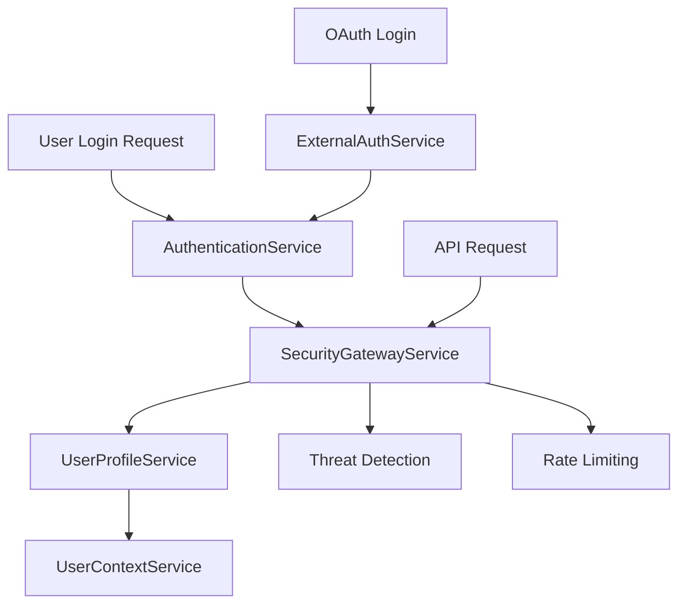

# 🔐 PHASE 1: AUTHENTICATION & SECURITY LAYER

## 🎯 **OVERVIEW**
- **Phase**: 1/5
- **Services**: 5 specialized authentication & security services
- **Purpose**: Secure user authentication, authorization, and threat protection
- **Dependencies**: None (Foundation services)
- **Implementation Priority**: CRITICAL - Must be completed first

---

## 🏗️ **ARCHITECTURE OVERVIEW**



---

## 🔥 **SERVICE IMPLEMENTATION PLAN**

### **1.1 AuthenticationService** 🚨 **PRIORITY: CRITICAL**
**File**: `src/app/services/auth/authentication.service.ts`

#### **Implementation Strategy**
```typescript
@Injectable({ providedIn: 'root' })
export class AuthenticationService {
  
  // Core Authentication Methods
  async login(username: string, password: string): Promise<AuthResult>
  async logout(): Promise<void>
  async refreshToken(): Promise<TokenResponse>
  
  // Token Management
  validateToken(token: string): boolean
  getAuthHeaders(): HttpHeaders
  isAuthenticated(): boolean
  getCurrentToken(): string | null
  setToken(token: string): void
}
```

#### **Key Features**
- JWT token generation and validation
- Secure token storage (HttpOnly cookies + localStorage)
- Automatic token refresh
- Session management
- Multi-factor authentication support

#### **Migration from AccountService**
```typescript
// MIGRATE THESE METHODS FROM AccountService:
// - login() method (lines 401-470) → AuthenticationService.login()
// - logout() method (lines 504-525) → AuthenticationService.logout()
// - setToken() method → AuthenticationService.setToken()
// - getToken() method → AuthenticationService.getCurrentToken()
```

#### **Validation Criteria**
- [ ] JWT token generation working
- [ ] Token expiration handling
- [ ] Secure token storage
- [ ] Authentication state management
- [ ] Session timeout handling

---

### **1.2 ExternalAuthService** 🌐 **PRIORITY: HIGH**
**File**: `src/app/services/auth/external-auth.service.ts`

#### **Implementation Strategy**
```typescript
@Injectable({ providedIn: 'root' })
export class ExternalAuthService {
  
  // Social Login Methods
  async loginWithGoogle(): Promise<AuthResult>
  async loginWithFacebook(): Promise<AuthResult>
  async loginWithMicrosoft(): Promise<AuthResult>
  async loginWithApple(): Promise<AuthResult>
  
  // OAuth Management
  async handleOAuthCallback(provider: string, code: string): Promise<AuthResult>
  async unlinkProvider(provider: string): Promise<void>
  async getLinkedProviders(): Promise<string[]>
}
```

#### **Key Features**
- Google OAuth2 integration
- Microsoft Azure AD integration
- Facebook Login integration
- Apple Sign-in integration
- SAML SSO support
- Account linking/unlinking

#### **Validation Criteria**
- [ ] OAuth2 flow implemented
- [ ] Social login providers configured
- [ ] Provider token validation
- [ ] Account linking functionality
- [ ] SAML SSO integration

---

### **1.3 SecurityGatewayService** 🛡️ **PRIORITY: CRITICAL**
**File**: `src/app/services/auth/security-gateway.service.ts`

#### **Implementation Strategy**
```typescript
@Injectable({ providedIn: 'root' })
export class SecurityGatewayService {
  
  // Request Security
  async validateRequest(request: HttpRequest<any>): Promise<boolean>
  async enforceSecurityPolicies(context: SecurityContext): Promise<void>
  
  // Threat Detection
  async detectThreats(request: HttpRequest<any>): Promise<ThreatLevel>
  blockMaliciousRequest(request: HttpRequest<any>): void
  
  // Data Protection
  encryptSensitiveData(data: any): string
  decryptSensitiveData(encryptedData: string): any
  logSecurityEvent(event: SecurityEvent): void
}
```

#### **Key Features**
- SQL injection protection
- XSS protection
- CSRF protection
- Request validation
- Threat detection and blocking
- Security event logging
- Data encryption/decryption

#### **Validation Criteria**
- [ ] Request validation rules enforced
- [ ] Security policies implemented
- [ ] SQL injection protection
- [ ] XSS protection
- [ ] CSRF protection
- [ ] Threat detection active
- [ ] Security event logging

---

### **1.4 UserProfileService** 👤 **PRIORITY: HIGH**
**File**: `src/app/services/auth/user-profile.service.ts`

#### **Implementation Strategy**
```typescript
@Injectable({ providedIn: 'root' })
export class UserProfileService {
  
  // Profile Management
  async getProfile(forceReload?: boolean): Promise<UserProfile>
  async updateProfile(profile: Partial<UserProfile>): Promise<UserProfile>
  
  // Settings Management
  async getUserSettings(): Promise<UserSettings>
  async updateUserSettings(settings: Partial<UserSettings>): Promise<void>
  
  // Permission Management
  async getUserPermissions(): Promise<Permission[]>
  async hasPermission(permission: string): Promise<boolean>
  async getUserRoles(): Promise<Role[]>
}
```

#### **Migration from AccountService**
```typescript
// MIGRATE THESE METHODS FROM AccountService:
// - getProfile() method (lines 216-259) → UserProfileService.getProfile()
// - setProfile() method → UserProfileService.updateProfile()
// - loadSavedProfile() method (lines 283-315) → UserProfileService.getProfile()
// - loadUserSettings() method (lines 197-215) → UserProfileService.getUserSettings()
```

#### **Key Features**
- User profile CRUD operations
- User settings management
- Permission-based access control
- Role-based access control
- Profile caching
- Avatar/photo management

#### **Validation Criteria**
- [ ] Profile CRUD operations working
- [ ] Settings management functional
- [ ] Permission-based access control
- [ ] Role-based access control
- [ ] Profile caching implemented

---

### **1.5 UserContextService** 🎭 **PRIORITY: MEDIUM**
**File**: `src/app/services/auth/user-context.service.ts`

#### **Implementation Strategy**
```typescript
@Injectable({ providedIn: 'root' })
export class UserContextService {
  
  // Context Management
  setCurrentUser(user: User): void
  getCurrentUser(): Observable<User>
  
  // Tenant Management
  getUserTenant(): Observable<Tenant>
  async switchTenant(tenantId: string): Promise<void>
  
  // Role & Permission Context
  getUserRoles(): Observable<Role[]>
  hasPermission(permission: string): Observable<boolean>
  
  // Session Management
  getCurrentSession(): Observable<UserSession>
  updateSessionActivity(): void
}
```

#### **Key Features**
- User context state management
- Tenant switching functionality
- Role-based permissions
- Session management
- Context state synchronization
- Observable-based reactive updates

#### **Validation Criteria**
- [ ] User context properly maintained
- [ ] Tenant switching functional
- [ ] Role-based permissions working
- [ ] Context state synchronization
- [ ] Session management

---

## 🎯 **FACADE PATTERN INTEGRATION**

### **AccountService Facade Implementation**
```typescript
@Injectable({ providedIn: 'root' })
export class AccountService {
  constructor(
    private authService: AuthenticationService,
    private extAuthService: ExternalAuthService,
    private profileService: UserProfileService,
    private contextService: UserContextService
  ) {}

  // FACADE METHODS - Delegate to specialized services
  async login(username: string, password: string) {
    return this.authService.login(username, password);
  }
  
  async getProfile() {
    return this.profileService.getProfile();
  }
  
  // ... other facade methods
}
```

---

## 🔒 **SECURITY IMPLEMENTATION DETAILS**

### **JWT Token Structure**
```json
{
  "header": {
    "alg": "HS256",
    "typ": "JWT"
  },
  "payload": {
    "sub": "userId",
    "name": "userName", 
    "email": "user@email.com",
    "roles": ["admin", "user"],
    "permissions": ["read", "write"],
    "tenant": "tenantId",
    "iat": 1234567890,
    "exp": 1234571490
  }
}
```

### **Security Headers**
```typescript
const securityHeaders = {
  'Authorization': `Bearer ${token}`,
  'X-Tenant-ID': tenantId,
  'X-Request-ID': requestId,
  'X-API-Version': 'v1'
};
```

### **Threat Detection Rules**
```typescript
const threatDetectionRules = {
  sqlInjection: /(\b(SELECT|INSERT|UPDATE|DELETE|DROP|CREATE|ALTER)\b)/i,
  xssAttempt: /(<script|javascript:|on\w+\s*=)/i,
  suspiciousPatterns: /(\.\./|\.\.\\|etc/passwd|cmd\.exe)/i
};
```

---

## ✅ **IMPLEMENTATION CHECKLIST**

### **Development Tasks**
- [ ] Create service interfaces
- [ ] Implement AuthenticationService
- [ ] Implement ExternalAuthService
- [ ] Implement SecurityGatewayService
- [ ] Implement UserProfileService
- [ ] Implement UserContextService
- [ ] Create AccountService facade
- [ ] Migrate methods from existing AccountService
- [ ] Implement security interceptors
- [ ] Add JWT token handling

### **Testing Tasks**
- [ ] Unit tests for all services
- [ ] Integration tests for authentication flows
- [ ] Security penetration testing
- [ ] OAuth flow testing
- [ ] Performance testing
- [ ] Load testing

### **Security Validation**
- [ ] JWT token security audit
- [ ] OAuth2 implementation review
- [ ] SQL injection testing
- [ ] XSS vulnerability testing
- [ ] CSRF protection testing
- [ ] Data encryption validation

---

## 🚀 **EXPECTED OUTCOMES**

### **Performance Metrics**
- Authentication response time: < 200ms
- Token validation time: < 50ms
- Profile loading time: < 100ms
- OAuth redirect time: < 500ms

### **Security Metrics**
- Zero critical vulnerabilities
- 100% request validation coverage
- 99.9% threat detection accuracy
- Complete audit trail

### **User Experience**
- Seamless single sign-on
- Fast authentication
- Smooth social login
- Secure session management

---

## 🔧 **TROUBLESHOOTING GUIDE**

### **Common Issues**
1. **Token Expiration**: Implement automatic refresh
2. **OAuth Redirect**: Validate callback URLs
3. **CORS Issues**: Configure proper headers
4. **Session Timeout**: Implement warning system

### **Debugging Tools**
- JWT debugger for token validation
- Network inspector for API calls
- Security scanner for vulnerability testing
- Performance profiler for optimization

---

**🎯 PHASE 1 is the foundation of the entire architecture. All subsequent phases depend on these authentication and security services working flawlessly.**
