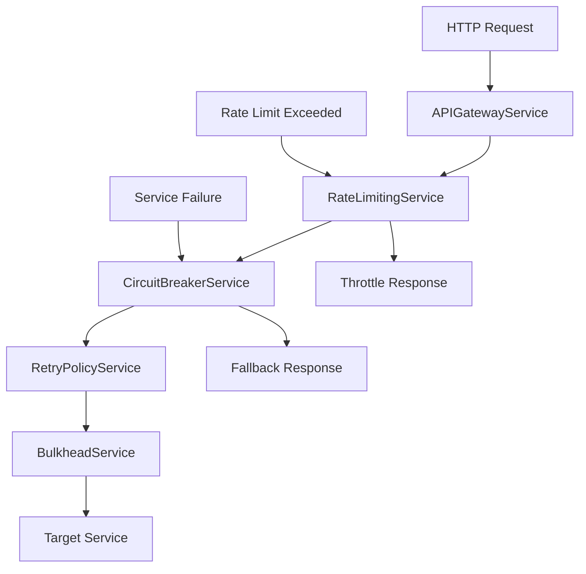

# 🏗️ PHASE 2: INFRASTRUCTURE FOUNDATION

## 🎯 **OVERVIEW**
- **Phase**: 2/5
- **Services**: 5 infrastructure and resilience services
- **Purpose**: Request routing, failure handling, and system resilience
- **Dependencies**: Phase 1 (Authentication & Security)
- **Implementation Priority**: HIGH - Core infrastructure services

---

## 🏗️ **ARCHITECTURE OVERVIEW**



---

## 🔥 **SERVICE IMPLEMENTATION PLAN**

### **2.1 APIGatewayService** 🚨 **PRIORITY: CRITICAL**
**File**: `src/app/services/infrastructure/api-gateway.service.ts`

#### **Implementation Strategy**
```typescript
@Injectable({ providedIn: 'root' })
export class APIGatewayService {
  
  // Request Routing
  routeRequest(request: HttpRequest<any>): Observable<HttpResponse<any>>
  loadBalanceRequest(endpoints: string[]): string
  
  // API Management
  handleAPIVersioning(request: HttpRequest<any>): HttpRequest<any>
  aggregateResponses(requests: HttpRequest<any>[]): Observable<any[]>
  
  // Request/Response Transformation
  transformRequest(request: HttpRequest<any>): HttpRequest<any>
  transformResponse(response: HttpResponse<any>): HttpResponse<any>
}
```

#### **Key Features**
- Intelligent request routing
- Load balancing across multiple endpoints
- API versioning support
- Request/Response transformation
- Response aggregation
- Service discovery integration

#### **Validation Criteria**
- [ ] Request routing working correctly
- [ ] Load balancing implemented
- [ ] API versioning handled
- [ ] Response aggregation functional
- [ ] Request/Response transformation

---

### **2.2 CircuitBreakerService** ⚡ **PRIORITY: CRITICAL**
**File**: `src/app/services/infrastructure/circuit-breaker.service.ts`

#### **Implementation Strategy**
```typescript
@Injectable({ providedIn: 'root' })
export class CircuitBreakerService {
  
  // Circuit Breaker Core
  async executeWithCircuitBreaker<T>(operation: () => Promise<T>, serviceKey: string): Promise<T>
  
  // State Management
  getCircuitState(serviceKey: string): CircuitState
  forceOpen(serviceKey: string): void
  forceClose(serviceKey: string): void
  
  // Monitoring
  getFailureStats(serviceKey: string): FailureStats
  registerFallback(serviceKey: string, fallback: () => any): void
}
```

#### **Circuit Breaker States**
```typescript
enum CircuitState {
  CLOSED = 'CLOSED',     // Normal operation
  OPEN = 'OPEN',         // Blocking requests
  HALF_OPEN = 'HALF_OPEN' // Testing recovery
}
```

#### **Key Features**
- Netflix Hystrix-style circuit breaker
- Automatic failure threshold detection
- Fallback mechanism implementation
- Circuit state monitoring
- Automatic recovery testing
- Custom fallback functions

#### **Validation Criteria**
- [ ] Circuit breaker states (Open/Closed/Half-Open) working
- [ ] Failure threshold detection
- [ ] Fallback mechanisms implemented
- [ ] Circuit state monitoring
- [ ] Automatic recovery testing

---

### **2.3 RetryPolicyService** 🔄 **PRIORITY: HIGH**
**File**: `src/app/services/infrastructure/retry-policy.service.ts`

#### **Implementation Strategy**
```typescript
@Injectable({ providedIn: 'root' })
export class RetryPolicyService {
  
  // Retry Execution
  async executeWithRetry<T>(operation: () => Promise<T>, policy: RetryPolicy): Promise<T>
  
  // Policy Creation
  createExponentialBackoffPolicy(maxRetries: number): RetryPolicy
  createLinearBackoffPolicy(maxRetries: number, delay: number): RetryPolicy
  createCustomPolicy(config: RetryConfig): RetryPolicy
  
  // Retry Logic
  shouldRetry(error: any, attempt: number, policy: RetryPolicy): boolean
}
```

#### **Retry Strategies**
```typescript
interface RetryPolicy {
  maxRetries: number;
  backoffStrategy: 'exponential' | 'linear' | 'custom';
  baseDelay: number;
  maxDelay: number;
  jitter: boolean;
  retryableErrors: ErrorType[];
}
```

#### **Key Features**
- Exponential backoff with jitter
- Linear backoff strategy
- Custom retry policies
- Error type-based retry logic
- Configurable retry attempts
- Maximum delay caps

#### **Validation Criteria**
- [ ] Retry mechanisms working
- [ ] Exponential backoff implemented
- [ ] Linear backoff implemented
- [ ] Configurable retry policies
- [ ] Error type-based retry logic

---

### **2.4 BulkheadService** 🏗️ **PRIORITY: MEDIUM**
**File**: `src/app/services/infrastructure/bulkhead.service.ts`

#### **Implementation Strategy**
```typescript
@Injectable({ providedIn: 'root' })
export class BulkheadService {
  
  // Resource Isolation
  async executeInBulkhead<T>(operation: () => Promise<T>, bulkheadKey: string): Promise<T>
  
  // Bulkhead Management
  createBulkhead(config: BulkheadConfig): void
  getBulkheadStats(bulkheadKey: string): BulkheadStats
  adjustBulkheadSize(bulkheadKey: string, newSize: number): void
  clearBulkhead(bulkheadKey: string): void
}
```

#### **Bulkhead Configuration**
```typescript
interface BulkheadConfig {
  key: string;
  maxConcurrentExecutions: number;
  maxWaitDuration: number;
  queueCapacity: number;
}
```

#### **Key Features**
- Resource pool isolation
- Concurrent execution limits
- Queue management
- Dynamic sizing
- Performance monitoring
- Resource contention prevention

#### **Validation Criteria**
- [ ] Resource isolation working
- [ ] Thread pool management
- [ ] Bulkhead configuration
- [ ] Performance monitoring
- [ ] Dynamic sizing

---

### **2.5 RateLimitingService** 🚦 **PRIORITY: HIGH**
**File**: `src/app/services/infrastructure/rate-limiting.service.ts`

#### **Implementation Strategy**
```typescript
@Injectable({ providedIn: 'root' })
export class RateLimitingService {
  
  // Rate Limiting
  async checkRateLimit(key: string, limit: RateLimit): Promise<RateLimitResult>
  
  // Limit Algorithms
  createTokenBucketLimit(capacity: number, refillRate: number): RateLimit
  createSlidingWindowLimit(requests: number, window: number): RateLimit
  createFixedWindowLimit(requests: number, window: number): RateLimit
  
  // Management
  getRateLimitStatus(key: string): Promise<RateLimitStatus>
  resetRateLimit(key: string): Promise<void>
}
```

#### **Rate Limiting Algorithms**
```typescript
interface RateLimit {
  algorithm: 'token-bucket' | 'sliding-window' | 'fixed-window';
  capacity: number;
  refillRate: number;
  window: number;
}
```

#### **Key Features**
- Token bucket algorithm
- Sliding window algorithm
- Fixed window algorithm
- Per-user rate limiting
- API endpoint protection
- DDoS prevention

#### **Validation Criteria**
- [ ] Rate limiting enforced
- [ ] Token bucket algorithm
- [ ] Sliding window algorithm
- [ ] Fixed window algorithm
- [ ] Multiple rate limit strategies
- [ ] Rate limit status tracking
- [ ] Configurable limits per user/service

---

## 🎯 **FACADE PATTERN INTEGRATION**

### **EnvService Facade Implementation**
```typescript
@Injectable({ providedIn: 'root' })
export class EnvService {
  constructor(
    private apiGateway: APIGatewayService,
    private circuitBreaker: CircuitBreakerService,
    private retryPolicy: RetryPolicyService,
    private bulkhead: BulkheadService,
    private rateLimiting: RateLimitingService
  ) {}

  // FACADE METHODS - Delegate to specialized services
  async makeRequest<T>(url: string, options?: any): Promise<T> {
    return this.circuitBreaker.executeWithCircuitBreaker(
      () => this.retryPolicy.executeWithRetry(
        () => this.apiGateway.routeRequest(/* request */),
        this.retryPolicy.createExponentialBackoffPolicy(3)
      ),
      'api-service'
    );
  }
}
```

---

## ⚡ **RESILIENCE PATTERNS**

### **Circuit Breaker Pattern**
```typescript
// Example: Circuit breaker with fallback
const result = await this.circuitBreaker.executeWithCircuitBreaker(
  () => this.apiService.getData(),
  'user-service',
  () => this.cache.getCachedData() // Fallback
);
```

### **Retry with Exponential Backoff**
```typescript
// Example: Retry with jitter
const policy = this.retryPolicy.createExponentialBackoffPolicy(3);
policy.jitter = true;
policy.maxDelay = 10000;

const result = await this.retryPolicy.executeWithRetry(
  () => this.apiService.updateData(data),
  policy
);
```

### **Bulkhead Isolation**
```typescript
// Example: Isolate critical operations
await this.bulkhead.executeInBulkhead(
  () => this.criticalService.processPayment(),
  'payment-operations'
);
```

### **Rate Limiting**
```typescript
// Example: API protection
const limit = this.rateLimiting.createTokenBucketLimit(100, 10);
const result = await this.rateLimiting.checkRateLimit(userId, limit);

if (result.allowed) {
  // Process request
} else {
  // Return rate limit error
}
```

---

## 📊 **MONITORING & METRICS**

### **Circuit Breaker Metrics**
```typescript
interface CircuitBreakerMetrics {
  serviceName: string;
  state: CircuitState;
  failureRate: number;
  successCount: number;
  failureCount: number;
  lastFailureTime: Date;
}
```

### **Rate Limiting Metrics**
```typescript
interface RateLimitMetrics {
  key: string;
  requestCount: number;
  remainingRequests: number;
  resetTime: Date;
  blocked: boolean;
}
```

---

## ✅ **IMPLEMENTATION CHECKLIST**

### **Development Tasks**
- [ ] Create infrastructure interfaces
- [ ] Implement APIGatewayService
- [ ] Implement CircuitBreakerService
- [ ] Implement RetryPolicyService
- [ ] Implement BulkheadService
- [ ] Implement RateLimitingService
- [ ] Create EnvService facade
- [ ] Implement monitoring dashboards
- [ ] Add performance metrics
- [ ] Create configuration management

### **Testing Tasks**
- [ ] Unit tests for all services
- [ ] Integration tests for resilience patterns
- [ ] Load testing for rate limiting
- [ ] Failure simulation testing
- [ ] Performance benchmarking
- [ ] Chaos engineering tests

### **Monitoring Setup**
- [ ] Circuit breaker state monitoring
- [ ] Rate limit metrics collection
- [ ] Failure rate tracking
- [ ] Response time monitoring
- [ ] Resource utilization tracking

---

## 🚀 **EXPECTED OUTCOMES**

### **Performance Metrics**
- API response time: < 200ms (95th percentile)
- Circuit breaker response: < 50ms
- Rate limit check: < 10ms
- Retry overhead: < 100ms additional

### **Resilience Metrics**
- Service availability: > 99.9%
- Failure recovery time: < 30 seconds
- Rate limit accuracy: > 99%
- Resource isolation effectiveness: 100%

### **System Benefits**
- Improved fault tolerance
- Better resource utilization
- Protection against cascade failures
- Enhanced system observability

---

## 🔧 **TROUBLESHOOTING GUIDE**

### **Common Issues**
1. **Circuit Breaker Stuck Open**: Check failure threshold settings
2. **Rate Limiting Too Strict**: Adjust token bucket parameters
3. **Retry Storms**: Implement exponential backoff with jitter
4. **Resource Exhaustion**: Monitor bulkhead utilization

### **Debugging Tools**
- Circuit breaker state dashboard
- Rate limiting metrics viewer
- Retry attempt tracer
- Resource utilization monitor

---

**🎯 PHASE 2 establishes the resilient infrastructure foundation that all other services depend on for reliable operation.**
