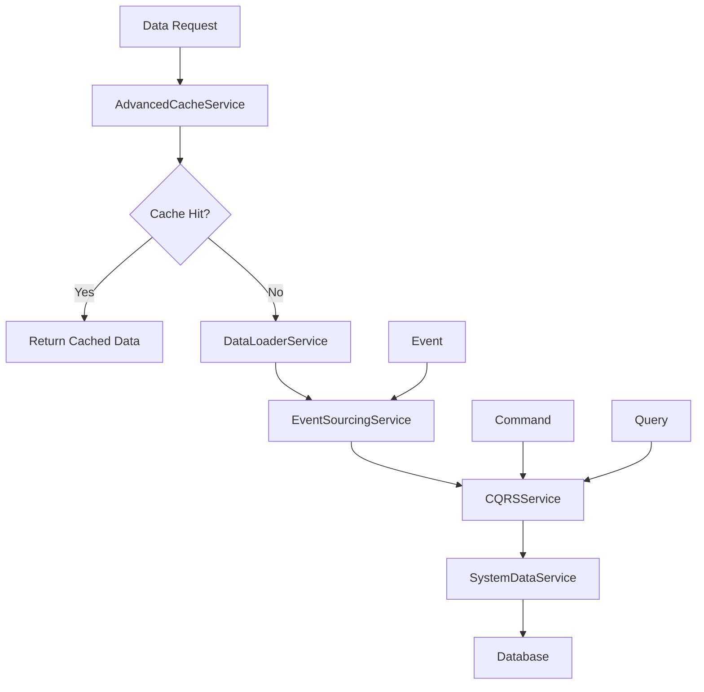

# 💾 PHASE 3: DATA & CACHING LAYER

## 🎯 **OVERVIEW**
- **Phase**: 3/5
- **Services**: 5 data management and caching services
- **Purpose**: Efficient data loading, multi-level caching, and event sourcing
- **Dependencies**: Phase 1 & 2 (Authentication, Security, Infrastructure)
- **Implementation Priority**: HIGH - Data performance optimization

---

## 🏗️ **ARCHITECTURE OVERVIEW**



---

## 🔥 **SERVICE IMPLEMENTATION PLAN**

### **3.1 AdvancedCacheService** 🚨 **PRIORITY: CRITICAL**
**File**: `src/app/services/data/advanced-cache.service.ts`

#### **Implementation Strategy**
```typescript
@Injectable({ providedIn: 'root' })
export class AdvancedCacheService {
  
  // Multi-Level Cache Operations
  async get<T>(key: string, level?: CacheLevel): Promise<T>
  async set<T>(key: string, value: T, ttl?: number, level?: CacheLevel): Promise<void>
  
  // Cache Management
  async invalidate(key: string, level?: CacheLevel): Promise<void>
  async invalidatePattern(pattern: string): Promise<void>
  async warmCache(keys: string[]): Promise<void>
  async clearCache(level?: CacheLevel): Promise<void>
  
  // Statistics
  getCacheStats(): CacheStats
}
```

#### **Multi-Level Cache Architecture**
```typescript
enum CacheLevel {
  L1_MEMORY = 'L1_MEMORY',           // In-memory (fastest, volatile)
  L2_LOCAL_STORAGE = 'L2_LOCAL_STORAGE', // Local storage (persistent)
  L3_INDEXED_DB = 'L3_INDEXED_DB',   // IndexedDB (large data)
  L4_SERVICE_WORKER = 'L4_SERVICE_WORKER' // Service worker (offline)
}
```

#### **Key Features**
- L1: Memory cache for immediate access
- L2: LocalStorage for session persistence
- L3: IndexedDB for large data sets
- L4: Service Worker for offline support
- Intelligent cache eviction policies
- Cache warming and preloading
- Pattern-based invalidation
- Comprehensive statistics

#### **Validation Criteria**
- [ ] L1 (Memory) cache working
- [ ] L2 (Local Storage) cache working  
- [ ] L3 (IndexedDB) cache working
- [ ] L4 (Service Worker) cache working
- [ ] Cache invalidation strategies
- [ ] Cache statistics tracking
- [ ] TTL expiration working

---

### **3.2 DataLoaderService** 📊 **PRIORITY: HIGH**
**File**: `src/app/services/data/data-loader.service.ts`

#### **Implementation Strategy**
```typescript
@Injectable({ providedIn: 'root' })
export class DataLoaderService {
  
  // Data Loading
  async load<T>(query: DataQuery): Promise<T[]>
  async loadBatch<T>(queries: DataQuery[]): Promise<T[][]>
  async loadParallel<T>(queries: DataQuery[]): Promise<T[][]>
  
  // Performance Optimization
  async preloadData(queries: DataQuery[]): Promise<void>
  optimizeQuery(query: DataQuery): DataQuery
  async loadWithFallback<T>(primary: DataQuery, fallback: DataQuery): Promise<T[]>
}
```

#### **Data Query Interface**
```typescript
interface DataQuery {
  endpoint: string;
  parameters?: any;
  cacheKey?: string;
  ttl?: number;
  priority: 'low' | 'medium' | 'high' | 'critical';
}
```

#### **Key Features**
- Intelligent data loading strategies
- Batch loading for efficiency
- Parallel loading for performance
- Query optimization
- Data preloading
- Fallback mechanisms
- Priority-based loading

#### **Migration from AccountService**
```typescript
// MIGRATE THESE METHODS FROM AccountService:
// - loadSavedData() method (lines 74-121) → DataLoaderService.load()
// - syncGetUserData() method (lines 260-282) → DataLoaderService.loadBatch()
```

#### **Validation Criteria**
- [ ] Efficient data loading
- [ ] Batch loading implemented
- [ ] Data preloading working
- [ ] Query optimization
- [ ] Parallel loading
- [ ] Fallback mechanisms

---

### **3.3 EventSourcingService** 📝 **PRIORITY: MEDIUM**
**File**: `src/app/services/data/event-sourcing.service.ts`

#### **Implementation Strategy**
```typescript
@Injectable({ providedIn: 'root' })
export class EventSourcingService {
  
  // Event Management
  async storeEvent(event: DomainEvent): Promise<void>
  async getEventStream(aggregateId: string): Promise<DomainEvent[]>
  async getEventsAfter(aggregateId: string, timestamp: Date): Promise<DomainEvent[]>
  
  // State Reconstruction
  async replayEvents(aggregateId: string, fromVersion?: number): Promise<any>
  async createSnapshot(aggregateId: string): Promise<void>
  async getSnapshot(aggregateId: string): Promise<any>
}
```

#### **Event Structure**
```typescript
interface DomainEvent {
  id: string;
  aggregateId: string;
  eventType: string;
  eventData: any;
  version: number;
  timestamp: Date;
  userId?: string;
  metadata?: any;
}
```

#### **Key Features**
- Immutable event storage
- Event stream management
- State reconstruction from events
- Snapshot creation for performance
- Event versioning support
- Audit trail capabilities

#### **Validation Criteria**
- [ ] Event storage working
- [ ] Event stream retrieval
- [ ] Event replay mechanism
- [ ] Snapshot creation and retrieval
- [ ] Event versioning
- [ ] Aggregate reconstruction

---

### **3.4 CQRSService** ⚔️ **PRIORITY: HIGH**
**File**: `src/app/services/data/cqrs.service.ts`

#### **Implementation Strategy**
```typescript
@Injectable({ providedIn: 'root' })
export class CQRSService {
  
  // Command/Query Execution
  async executeCommand<T>(command: Command): Promise<T>
  async executeQuery<T>(query: Query): Promise<T>
  
  // Handler Management
  registerCommandHandler(commandType: string, handler: CommandHandler): void
  registerQueryHandler(queryType: string, handler: QueryHandler): void
  
  // Validation & History
  async validateCommand(command: Command): Promise<boolean>
  async getCommandHistory(aggregateId: string): Promise<Command[]>
}
```

#### **CQRS Patterns**
```typescript
interface Command {
  type: string;
  aggregateId: string;
  data: any;
  userId: string;
  timestamp: Date;
}

interface Query {
  type: string;
  parameters: any;
  cacheKey?: string;
  ttl?: number;
}
```

#### **Key Features**
- Clear command/query separation
- Command validation
- Query optimization
- Handler registration system
- Command history tracking
- Event integration

#### **Validation Criteria**
- [ ] Command handling working
- [ ] Query handling working
- [ ] Command/Query separation enforced
- [ ] Handler registration system
- [ ] Command validation
- [ ] Query optimization

---

### **3.5 SystemDataService** ⚙️ **PRIORITY: MEDIUM**
**File**: `src/app/services/data/system-data.service.ts`

#### **Implementation Strategy**
```typescript
@Injectable({ providedIn: 'root' })
export class SystemDataService {
  
  // Configuration Management
  async getSystemConfig(key: string): Promise<any>
  async updateSystemConfig(key: string, value: any): Promise<void>
  async refreshSystemData(): Promise<void>
  
  // Metadata Management
  async getMetadata(entity: string): Promise<EntityMetadata>
  
  // System Data
  async getStatusList(): Promise<Status[]>
  async getTypeList(): Promise<Type[]>
  async cacheSystemData(): Promise<void>
}
```

#### **System Data Types**
```typescript
interface EntityMetadata {
  entityName: string;
  fields: FieldMetadata[];
  relationships: RelationshipMetadata[];
  validations: ValidationRule[];
}

interface Status {
  id: number;
  code: string;
  name: string;
  color?: string;
  icon?: string;
}
```

#### **Key Features**
- System configuration management
- Metadata management
- Status and type lists
- System data caching
- Configuration updates
- Schema management

#### **Validation Criteria**
- [ ] System configuration management
- [ ] Metadata retrieval
- [ ] System data caching
- [ ] Configuration updates
- [ ] Status/Type lists management

---

## 🎯 **CACHING STRATEGIES**

### **Cache Hierarchies**
```typescript
// L1 Cache: Memory (Fastest)
const memoryCache = new Map<string, CacheItem>();

// L2 Cache: Local Storage
localStorage.setItem(key, JSON.stringify(value));

// L3 Cache: IndexedDB (Large Data)
const db = await this.openIndexedDB();
await db.put('cache-store', { key, value, ttl });

// L4 Cache: Service Worker (Offline)
await caches.open('api-cache').then(cache => 
  cache.put(request, response)
);
```

### **Cache Invalidation Patterns**
```typescript
// Time-based expiration
cache.set(key, value, { ttl: 300000 }); // 5 minutes

// Tag-based invalidation
cache.set(key, value, { tags: ['user:123', 'profile'] });
cache.invalidateByTag('user:123');

// Pattern-based invalidation
cache.invalidatePattern('user:*:profile');
```

### **Cache Warming Strategy**
```typescript
// Predictive cache warming
async warmUserCache(userId: string) {
  const predictedQueries = await this.predictiveAnalytics
    .predictUserQueries(userId);
  
  await Promise.all(
    predictedQueries.map(query => this.preloadData(query))
  );
}
```

---

## 📊 **EVENT SOURCING PATTERNS**

### **Event Store Schema**
```sql
CREATE TABLE events (
  id UUID PRIMARY KEY,
  aggregate_id UUID NOT NULL,
  event_type VARCHAR(100) NOT NULL,
  event_data JSONB NOT NULL,
  version INTEGER NOT NULL,
  timestamp TIMESTAMP NOT NULL,
  user_id UUID,
  metadata JSONB
);

CREATE INDEX idx_events_aggregate ON events(aggregate_id, version);
```

### **Snapshot Strategy**
```typescript
// Create snapshot every 100 events
if (eventCount % 100 === 0) {
  await this.createSnapshot(aggregateId);
}

// Replay from snapshot
const snapshot = await this.getSnapshot(aggregateId);
const eventsAfterSnapshot = await this.getEventsAfter(
  aggregateId, 
  snapshot.timestamp
);
```

---

## ✅ **IMPLEMENTATION CHECKLIST**

### **Development Tasks**
- [ ] Create data interfaces
- [ ] Implement AdvancedCacheService with L1-L4 levels
- [ ] Implement DataLoaderService with optimization
- [ ] Implement EventSourcingService
- [ ] Implement CQRSService
- [ ] Implement SystemDataService
- [ ] Create cache warming strategies
- [ ] Implement event store
- [ ] Add snapshot mechanisms
- [ ] Create data migration tools

### **Performance Tasks**
- [ ] Cache hit rate optimization (target >85%)
- [ ] Query optimization
- [ ] Memory usage optimization
- [ ] IndexedDB performance tuning
- [ ] Service worker cache optimization

### **Testing Tasks**
- [ ] Unit tests for all services
- [ ] Cache performance testing
- [ ] Event sourcing integration tests
- [ ] CQRS pattern validation
- [ ] Load testing for data operations
- [ ] Cache invalidation testing

---

## 🚀 **EXPECTED OUTCOMES**

### **Performance Metrics**
- Cache hit rate: >85%
- Data loading time: <100ms (cached)
- Query response time: <200ms
- Event replay time: <500ms
- Memory usage: <50MB for cache

### **Data Metrics**
- Event storage reliability: 100%
- Cache consistency: 100%
- Data freshness: <30 seconds
- Query optimization: 40% improvement

### **User Experience**
- Instant data access from cache
- Offline data availability
- Fast application startup
- Smooth data synchronization

---

## 🔧 **TROUBLESHOOTING GUIDE**

### **Common Issues**
1. **Cache Memory Leaks**: Implement proper TTL and eviction
2. **IndexedDB Quota**: Monitor storage usage and cleanup
3. **Event Store Growth**: Implement snapshot strategy
4. **Cache Inconsistency**: Use proper invalidation patterns

### **Monitoring Tools**
- Cache hit/miss ratio dashboard
- Memory usage monitoring
- Event store growth tracking
- Query performance analyzer

---

**🎯 PHASE 3 establishes the high-performance data layer that enables lightning-fast user experiences and reliable data management.**
