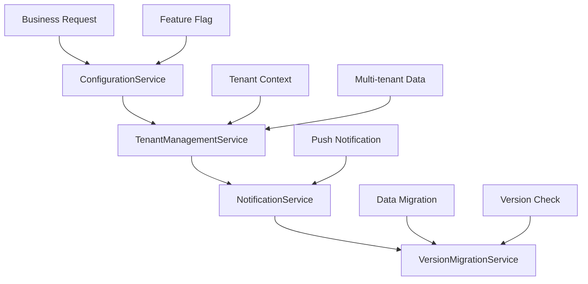

# 🏢 PHASE 4: BUSINESS LOGIC LAYER

## 🎯 **OVERVIEW**
- **Phase**: 4/5
- **Services**: 4 business-focused services
- **Purpose**: Configuration management, multi-tenancy, notifications, and version control
- **Dependencies**: Phase 1, 2, 3 (Auth, Infrastructure, Data)
- **Implementation Priority**: MEDIUM - Business feature enablement

---

## 🏗️ **ARCHITECTURE OVERVIEW**



---

## 🔥 **SERVICE IMPLEMENTATION PLAN**

### **4.1 ConfigurationService** ⚙️ **PRIORITY: HIGH**
**File**: `src/app/services/business/configuration.service.ts`

#### **Implementation Strategy**
```typescript
@Injectable({ providedIn: 'root' })
export class ConfigurationService {
  
  // Configuration Management
  async getConfig(key: string): Promise<any>
  async setConfig(key: string, value: any): Promise<void>
  
  // Feature Flags
  async getFeatureFlag(flag: string): Promise<boolean>
  async updateFeatureFlag(flag: string, enabled: boolean): Promise<void>
  
  // Environment Configuration
  async getEnvironmentConfig(): Promise<EnvironmentConfig>
  async refreshConfig(): Promise<void>
}
```

#### **Configuration Types**
```typescript
interface AppConfiguration {
  apiEndpoints: ApiEndpoints;
  featureFlags: FeatureFlags;
  uiSettings: UiSettings;
  businessRules: BusinessRules;
}

interface FeatureFlags {
  [key: string]: {
    enabled: boolean;
    rolloutPercentage?: number;
    targetUsers?: string[];
    startDate?: Date;
    endDate?: Date;
  };
}
```

#### **Key Features**
- Dynamic feature flag management
- Environment-specific configurations
- Real-time configuration updates
- A/B testing support
- Configuration versioning
- Rollback capabilities

#### **Validation Criteria**
- [ ] Configuration management
- [ ] Feature flag control
- [ ] Environment-specific configs
- [ ] Real-time config updates
- [ ] Config caching

---

### **4.2 TenantManagementService** 🏬 **PRIORITY: HIGH**
**File**: `src/app/services/business/tenant-management.service.ts`

#### **Implementation Strategy**
```typescript
@Injectable({ providedIn: 'root' })
export class TenantManagementService {
  
  // Tenant Management
  async getCurrentTenant(): Promise<Tenant>
  async switchTenant(tenantId: string): Promise<void>
  
  // Tenant Configuration
  async getTenantConfig(tenantId: string): Promise<TenantConfig>
  async getTenantUsers(tenantId: string): Promise<User[]>
  async getTenantPermissions(tenantId: string): Promise<Permission[]>
  
  // Data Isolation
  async enforceTenantIsolation(request: any): Promise<any>
}
```

#### **Multi-Tenancy Model**
```typescript
interface Tenant {
  id: string;
  name: string;
  domain: string;
  subscription: SubscriptionPlan;
  settings: TenantSettings;
  customization: TenantCustomization;
}

interface TenantConfig {
  features: string[];
  limits: ResourceLimits;
  integrations: Integration[];
  branding: BrandingConfig;
}
```

#### **Key Features**
- Complete tenant isolation
- Tenant-specific configurations
- Resource limits per tenant
- Custom branding per tenant
- Tenant user management
- Subscription management
- Data segregation

#### **Validation Criteria**
- [ ] Multi-tenancy support
- [ ] Tenant isolation enforced
- [ ] Tenant switching functionality
- [ ] Tenant-specific configurations
- [ ] Tenant user management
- [ ] Tenant permission management

---

### **4.3 NotificationService** 📢 **PRIORITY: MEDIUM**
**File**: `src/app/services/business/notification.service.ts`

#### **Implementation Strategy**
```typescript
@Injectable({ providedIn: 'root' })
export class NotificationService {
  
  // Notification Sending
  async sendPushNotification(notification: PushNotification): Promise<void>
  async sendEmail(email: EmailNotification): Promise<void>
  async sendSMS(sms: SMSNotification): Promise<void>
  
  // Scheduling
  async scheduleNotification(notification: ScheduledNotification): Promise<void>
  
  // Management
  async getNotificationHistory(userId: string): Promise<Notification[]>
  async markAsRead(notificationId: string): Promise<void>
  async getUnreadCount(userId: string): Promise<number>
}
```

#### **Notification Types**
```typescript
interface PushNotification {
  title: string;
  body: string;
  icon?: string;
  badge?: string;
  data?: any;
  actions?: NotificationAction[];
  targetUsers: string[];
}

interface EmailNotification {
  to: string[];
  subject: string;
  htmlBody: string;
  textBody?: string;
  attachments?: Attachment[];
  template?: string;
}
```

#### **Key Features**
- Push notification system
- Email notification system
- SMS notification system
- Scheduled notifications
- Notification templates
- User preferences
- Delivery tracking
- Read/unread status

#### **Validation Criteria**
- [ ] Push notifications working
- [ ] Email notifications working
- [ ] SMS notifications working
- [ ] Scheduled notifications
- [ ] Notification history tracking
- [ ] Read/unread status management

---

### **4.4 VersionMigrationService** 🔄 **PRIORITY: HIGH**
**File**: `src/app/services/business/version-migration.service.ts`

#### **Implementation Strategy**
```typescript
@Injectable({ providedIn: 'root' })
export class VersionMigrationService {
  
  // Version Management
  async checkVersion(): Promise<VersionCheckResult>
  
  // Migration Execution
  async migrateData(fromVersion: string, toVersion: string): Promise<void>
  async executeMigrationStep(step: MigrationStep): Promise<void>
  
  // Migration Planning
  createMigrationPlan(fromVersion: string, toVersion: string): MigrationPlan
  async validateMigration(): Promise<boolean>
  
  // Rollback
  async rollbackMigration(toVersion: string): Promise<void>
  async getMigrationHistory(): Promise<Migration[]>
}
```

#### **Migration Framework**
```typescript
interface MigrationPlan {
  fromVersion: string;
  toVersion: string;
  steps: MigrationStep[];
  estimatedTime: number;
  risks: RiskAssessment[];
}

interface MigrationStep {
  id: string;
  description: string;
  execute: () => Promise<void>;
  rollback: () => Promise<void>;
  validation: () => Promise<boolean>;
}
```

#### **Migration from AccountService**
```typescript
// MIGRATE THIS METHOD FROM AccountService:
// - checkVersion() method (lines 122-196) → VersionMigrationService.checkVersion()
```

#### **Key Features**
- Automated version checking
- Step-by-step data migration
- Migration rollback capability
- Migration validation
- Progress tracking
- Risk assessment
- Backup creation

#### **Validation Criteria**
- [ ] Version checking working
- [ ] Data migration successful
- [ ] Rollback capability
- [ ] Migration history tracking
- [ ] Migration validation
- [ ] Step-by-step migration

---

## 🎯 **BUSINESS LOGIC PATTERNS**

### **Feature Flag Implementation**
```typescript
// Simple feature flag
const isNewUIEnabled = await this.configService
  .getFeatureFlag('new-ui-enabled');

// Advanced feature flag with rollout
const featureFlag = await this.configService
  .getFeatureFlag('premium-features');

if (featureFlag.enabled && 
    (featureFlag.rolloutPercentage > Math.random() * 100 ||
     featureFlag.targetUsers?.includes(userId))) {
  // Enable premium features
}
```

### **Multi-Tenant Data Access**
```typescript
// Automatic tenant isolation
@Injectable()
export class TenantDataInterceptor implements HttpInterceptor {
  intercept(req: HttpRequest<any>, next: HttpHandler) {
    const tenantId = this.tenantService.getCurrentTenant().id;
    const tenantReq = req.clone({
      setHeaders: {
        'X-Tenant-ID': tenantId
      }
    });
    return next.handle(tenantReq);
  }
}
```

### **Notification Strategy Pattern**
```typescript
// Notification strategy based on user preference
const userPreferences = await this.getUserNotificationPreferences(userId);

const strategies: NotificationStrategy[] = [];
if (userPreferences.push) strategies.push(new PushNotificationStrategy());
if (userPreferences.email) strategies.push(new EmailNotificationStrategy());
if (userPreferences.sms) strategies.push(new SMSNotificationStrategy());

await Promise.all(
  strategies.map(strategy => strategy.send(notification))
);
```

### **Migration State Machine**
```typescript
// Migration state management
enum MigrationState {
  PENDING = 'PENDING',
  RUNNING = 'RUNNING',
  COMPLETED = 'COMPLETED',
  FAILED = 'FAILED',
  ROLLED_BACK = 'ROLLED_BACK'
}

class MigrationStateMachine {
  private state: MigrationState = MigrationState.PENDING;
  
  async execute(migration: Migration) {
    this.state = MigrationState.RUNNING;
    try {
      await this.runMigration(migration);
      this.state = MigrationState.COMPLETED;
    } catch (error) {
      this.state = MigrationState.FAILED;
      await this.rollback(migration);
      this.state = MigrationState.ROLLED_BACK;
    }
  }
}
```

---

## 📊 **CONFIGURATION MANAGEMENT**

### **Configuration Schema**
```json
{
  "api": {
    "baseUrl": "https://api.example.com",
    "timeout": 30000,
    "retries": 3
  },
  "features": {
    "newDashboard": {
      "enabled": true,
      "rolloutPercentage": 50
    },
    "advancedReports": {
      "enabled": false,
      "targetTenants": ["enterprise"]
    }
  },
  "ui": {
    "theme": "light",
    "language": "en",
    "dateFormat": "MM/DD/YYYY"
  }
}
```

### **Feature Flag Management Dashboard**
```typescript
interface FeatureFlagDashboard {
  flags: FeatureFlag[];
  analytics: {
    usage: FlagUsage[];
    performance: FlagPerformance[];
    errors: FlagError[];
  };
  controls: {
    enable: (flagName: string) => void;
    disable: (flagName: string) => void;
    setRollout: (flagName: string, percentage: number) => void;
  };
}
```

---

## ✅ **IMPLEMENTATION CHECKLIST**

### **Development Tasks**
- [ ] Create business interfaces
- [ ] Implement ConfigurationService
- [ ] Implement TenantManagementService
- [ ] Implement NotificationService
- [ ] Implement VersionMigrationService
- [ ] Create feature flag management
- [ ] Implement tenant isolation
- [ ] Add notification templates
- [ ] Create migration framework
- [ ] Add configuration dashboard

### **Business Logic Tasks**
- [ ] Define feature flag strategies
- [ ] Configure tenant isolation rules
- [ ] Set up notification channels
- [ ] Create migration scripts
- [ ] Implement rollback procedures

### **Testing Tasks**
- [ ] Unit tests for all services
- [ ] Integration tests for business flows
- [ ] Multi-tenancy testing
- [ ] Migration testing
- [ ] Feature flag testing
- [ ] Notification delivery testing

---

## 🚀 **EXPECTED OUTCOMES**

### **Business Metrics**
- Feature rollout success rate: >95%
- Tenant isolation accuracy: 100%
- Notification delivery rate: >98%
- Migration success rate: >99%

### **Performance Metrics**
- Configuration loading time: <100ms
- Tenant switching time: <200ms
- Notification sending time: <500ms
- Migration execution time: varies by complexity

### **User Experience**
- Seamless feature rollouts
- Tenant-specific customization
- Timely notifications
- Smooth version upgrades

---

## 🔧 **TROUBLESHOOTING GUIDE**

### **Common Issues**
1. **Feature Flag Conflicts**: Implement dependency checking
2. **Tenant Data Leakage**: Validate isolation rules
3. **Notification Failures**: Implement retry mechanisms
4. **Migration Rollback**: Test rollback procedures

### **Monitoring Tools**
- Feature flag usage analytics
- Tenant isolation monitoring
- Notification delivery tracking
- Migration progress monitoring

---

**🎯 PHASE 4 provides the essential business logic layer that enables advanced features like multi-tenancy, feature flags, and seamless upgrades.**
