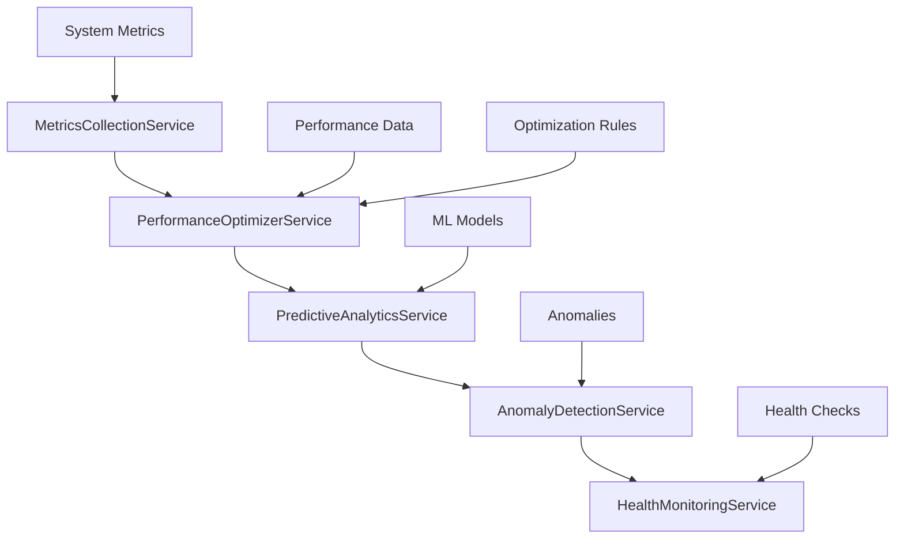

# 🤖 PHASE 5: AI & OPTIMIZATION LAYER

## 🎯 **OVERVIEW**
- **Phase**: 5/5
- **Services**: 5 AI-powered optimization services
- **Purpose**: Intelligent performance optimization, predictive analytics, and system monitoring
- **Dependencies**: All previous phases (Complete foundation required)
- **Implementation Priority**: ADVANCED - Cutting-edge AI capabilities

---

## 🏗️ **ARCHITECTURE OVERVIEW**



---

## 🔥 **SERVICE IMPLEMENTATION PLAN**

### **5.1 PerformanceOptimizerService** 🚀 **PRIORITY: HIGH**
**File**: `src/app/services/optimization/performance-optimizer.service.ts`

#### **Implementation Strategy**
```typescript
@Injectable({ providedIn: 'root' })
export class PerformanceOptimizerService {
  
  // Core Optimization
  async optimizeApplication(): Promise<OptimizationResult>
  async autoTuneParameters(): Promise<void>
  
  // Analysis
  async analyzePerformance(): Promise<PerformanceAnalysis>
  async measurePerformance<T>(operation: () => Promise<T>): Promise<PerformanceResult<T>>
  
  // Specific Optimizations
  async optimizeMemoryUsage(): Promise<void>
  async optimizeNetworkRequests(): Promise<void>
  async recommendOptimizations(): Promise<Recommendation[]>
}
```

#### **Optimization Algorithms**
```typescript
interface OptimizationResult {
  improvements: {
    memoryReduction: number;
    speedIncrease: number;
    cacheHitRateImprovement: number;
    networkOptimization: number;
  };
  appliedOptimizations: string[];
  estimatedImpact: PerformanceImpact;
}

interface PerformanceResult<T> {
  result: T;
  executionTime: number;
  memoryUsage: number;
  networkCalls: number;
  cacheHits: number;
  recommendations: string[];
}
```

#### **Key Features**
- Real-time performance analysis
- Automatic parameter tuning
- Memory usage optimization
- Network request optimization
- Cache optimization
- Bundle size optimization
- Code splitting optimization

#### **Validation Criteria**
- [ ] Performance analysis working
- [ ] Auto-tuning implemented
- [ ] Memory optimization
- [ ] Network optimization
- [ ] Optimization recommendations
- [ ] Performance improvements measurable

---

### **5.2 PredictiveAnalyticsService** 🧠 **PRIORITY: HIGH**
**File**: `src/app/services/optimization/predictive-analytics.service.ts`

#### **Implementation Strategy**
```typescript
@Injectable({ providedIn: 'root' })
export class PredictiveAnalyticsService {
  
  // User Behavior Prediction
  async predictUserBehavior(userId: string): Promise<BehaviorPrediction>
  async predictCacheHits(keys: string[]): Promise<CachePrediction[]>
  
  // System Predictions
  async forecastSystemLoad(): Promise<LoadForecast>
  async predictResourceNeeds(): Promise<ResourcePrediction>
  async forecastPerformanceBottlenecks(): Promise<Bottleneck[]>
  
  // Pattern Analysis
  async analyzeUsagePatterns(): Promise<UsagePattern[]>
}
```

#### **ML Models Integration**
```typescript
interface BehaviorPrediction {
  userId: string;
  predictedActions: PredictedAction[];
  confidenceScore: number;
  recommendedPreloads: string[];
  suggestedCacheWarm: string[];
}

interface LoadForecast {
  timeframe: string;
  predictedLoad: number;
  peakTimes: Date[];
  resourceRequirements: ResourceRequirement[];
  scalingRecommendations: ScalingRecommendation[];
}
```

#### **Key Features**
- User behavior prediction
- System load forecasting
- Resource demand prediction
- Cache hit prediction
- Performance bottleneck prediction
- Usage pattern analysis

#### **Validation Criteria**
- [ ] ML models deployed
- [ ] Prediction accuracy measured
- [ ] Usage pattern analysis
- [ ] Resource forecasting
- [ ] Cache prediction
- [ ] Bottleneck prediction

---

### **5.3 AnomalyDetectionService** 🔍 **PRIORITY: MEDIUM**
**File**: `src/app/services/optimization/anomaly-detection.service.ts`

#### **Implementation Strategy**
```typescript
@Injectable({ providedIn: 'root' })
export class AnomalyDetectionService {
  
  // Anomaly Detection
  async detectAnomalies(data: MetricData[]): Promise<Anomaly[]>
  async predictAnomalies(data: MetricData[]): Promise<AnomalyPrediction[]>
  
  // Model Management
  async trainAnomalyModel(trainingData: MetricData[]): Promise<void>
  async classifyAnomaly(anomaly: Anomaly): Promise<AnomalyType>
  
  // Configuration
  async setAnomalyThresholds(thresholds: AnomalyThreshold[]): Promise<void>
  async getAnomalyHistory(): Promise<Anomaly[]>
}
```

#### **Anomaly Detection Algorithms**
```typescript
interface Anomaly {
  id: string;
  timestamp: Date;
  metricName: string;
  actualValue: number;
  expectedValue: number;
  deviation: number;
  severity: 'low' | 'medium' | 'high' | 'critical';
  type: AnomalyType;
  possibleCauses: string[];
}

enum AnomalyType {
  PERFORMANCE_DEGRADATION = 'PERFORMANCE_DEGRADATION',
  MEMORY_LEAK = 'MEMORY_LEAK',
  NETWORK_ISSUE = 'NETWORK_ISSUE',
  SECURITY_THREAT = 'SECURITY_THREAT',
  USER_BEHAVIOR = 'USER_BEHAVIOR'
}
```

#### **Key Features**
- Real-time anomaly detection
- Machine learning model training
- Anomaly classification
- Predictive anomaly detection
- Custom threshold configuration
- Anomaly root cause analysis

#### **Validation Criteria**
- [ ] Anomaly detection working
- [ ] Model training functional
- [ ] Configurable thresholds
- [ ] Anomaly alerting
- [ ] Anomaly classification
- [ ] Anomaly prediction

---

### **5.4 HealthMonitoringService** 💚 **PRIORITY: HIGH**
**File**: `src/app/services/optimization/health-monitoring.service.ts`

#### **Implementation Strategy**
```typescript
@Injectable({ providedIn: 'root' })
export class HealthMonitoringService {
  
  // Health Checks
  async checkServiceHealth(service: string): Promise<HealthStatus>
  async getAllServiceHealth(): Promise<SystemHealth>
  
  // Health Management
  registerHealthCheck(service: string, checker: HealthChecker): void
  async setHealthThresholds(service: string, thresholds: HealthThreshold): void
  
  // Monitoring
  async getHealthHistory(service?: string): Promise<HealthRecord[]>
  async triggerHealthAlert(service: string, status: HealthStatus): Promise<void>
}
```

#### **Health Monitoring Framework**
```typescript
interface HealthStatus {
  service: string;
  status: 'healthy' | 'degraded' | 'unhealthy' | 'critical';
  checks: HealthCheck[];
  overallScore: number;
  timestamp: Date;
}

interface HealthCheck {
  name: string;
  status: 'pass' | 'warn' | 'fail';
  responseTime: number;
  details?: any;
}

interface SystemHealth {
  overallStatus: 'healthy' | 'degraded' | 'unhealthy';
  services: HealthStatus[];
  criticalIssues: string[];
  warnings: string[];
}
```

#### **Key Features**
- Comprehensive health monitoring
- Custom health checks
- Health threshold management
- Health history tracking
- Automated health alerts
- Service dependency monitoring

#### **Validation Criteria**
- [ ] Health checks working
- [ ] Service monitoring active
- [ ] Health history tracking
- [ ] Alerting on health issues
- [ ] Custom health checks
- [ ] Health threshold management

---

### **5.5 MetricsCollectionService** 📊 **PRIORITY: CRITICAL**
**File**: `src/app/services/optimization/metrics-collection.service.ts`

#### **Implementation Strategy**
```typescript
@Injectable({ providedIn: 'root' })
export class MetricsCollectionService {
  
  // Metrics Collection
  async collectMetric(metric: Metric): Promise<void>
  async scheduleMetricCollection(schedule: MetricSchedule): Promise<void>
  
  // Metrics Retrieval
  async getMetrics(filter: MetricFilter): Promise<Metric[]>
  async aggregateMetrics(metrics: Metric[]): Promise<AggregatedMetric[]>
  
  // Analysis & Export
  async analyzeMetricTrends(metrics: Metric[]): Promise<TrendAnalysis[]>
  async exportMetrics(format: ExportFormat): Promise<string>
  async createDashboard(metrics: string[]): Promise<Dashboard>
}
```

#### **Metrics Framework**
```typescript
interface Metric {
  name: string;
  value: number;
  unit: string;
  timestamp: Date;
  tags: { [key: string]: string };
  source: string;
}

interface AggregatedMetric {
  name: string;
  aggregationType: 'sum' | 'avg' | 'min' | 'max' | 'count';
  value: number;
  timeframe: string;
  dataPoints: number;
}

interface TrendAnalysis {
  metric: string;
  trend: 'increasing' | 'decreasing' | 'stable' | 'volatile';
  changeRate: number;
  prediction: number;
  confidence: number;
}
```

#### **Key Features**
- Real-time metrics collection
- Scheduled metric collection
- Metrics aggregation
- Trend analysis
- Custom dashboards
- Metrics export
- Performance analytics

#### **Validation Criteria**
- [ ] Metrics collection working
- [ ] Metric querying functional
- [ ] Data aggregation working
- [ ] Export functionality
- [ ] Dashboard creation
- [ ] Scheduled collection
- [ ] Trend analysis

---

## 🤖 **AI & ML IMPLEMENTATION**

### **Machine Learning Pipeline**
```typescript
// ML Model Training Pipeline
class MLPipeline {
  async trainModel(data: TrainingData[]): Promise<MLModel> {
    const preprocessedData = await this.preprocess(data);
    const model = await this.train(preprocessedData);
    const validatedModel = await this.validate(model);
    return validatedModel;
  }
  
  async predict(model: MLModel, input: any): Promise<Prediction> {
    const preprocessedInput = await this.preprocess(input);
    const prediction = await model.predict(preprocessedInput);
    return this.postprocess(prediction);
  }
}
```

### **Real-Time Analytics**
```typescript
// Stream processing for real-time analytics
@Injectable()
export class RealTimeAnalytics {
  private metricsStream$ = new Subject<Metric>();
  
  constructor() {
    this.metricsStream$.pipe(
      bufferTime(5000), // Collect metrics for 5 seconds
      filter(metrics => metrics.length > 0),
      map(metrics => this.aggregateMetrics(metrics)),
      switchMap(aggregated => this.analyzeMetrics(aggregated))
    ).subscribe(analysis => {
      this.processAnalysis(analysis);
    });
  }
}
```

### **Intelligent Caching**
```typescript
// AI-powered cache optimization
class IntelligentCache {
  async optimizeCacheStrategy(usagePattern: UsagePattern): Promise<CacheStrategy> {
    const prediction = await this.predictiveAnalytics
      .predictCacheUsage(usagePattern);
    
    return {
      preloadKeys: prediction.highProbabilityKeys,
      evictionStrategy: this.selectOptimalEviction(prediction),
      cacheSize: this.calculateOptimalSize(prediction)
    };
  }
}
```

---

## 📊 **AI-POWERED DASHBOARDS**

### **Performance Dashboard**
```typescript
interface AIPerformanceDashboard {
  realTimeMetrics: LiveMetric[];
  predictions: {
    performance: PerformancePrediction;
    bottlenecks: BottleneckPrediction[];
    resourceNeeds: ResourcePrediction;
  };
  recommendations: OptimizationRecommendation[];
  anomalies: AnomalyAlert[];
}
```

### **Predictive Alerts**
```typescript
// AI-powered alerting system
class PredictiveAlertSystem {
  async generateAlerts(): Promise<Alert[]> {
    const predictions = await this.predictiveAnalytics.getPredictions();
    const anomalies = await this.anomalyDetection.detectAnomalies();
    
    return this.combineIntelligentAlerts(predictions, anomalies);
  }
}
```

---

## ✅ **IMPLEMENTATION CHECKLIST**

### **AI/ML Development Tasks**
- [ ] Set up ML model training infrastructure
- [ ] Implement PerformanceOptimizerService
- [ ] Implement PredictiveAnalyticsService
- [ ] Implement AnomalyDetectionService
- [ ] Implement HealthMonitoringService
- [ ] Implement MetricsCollectionService
- [ ] Train initial ML models
- [ ] Create AI dashboards
- [ ] Implement real-time analytics
- [ ] Add predictive alerting

### **Data Pipeline Tasks**
- [ ] Set up metrics collection pipeline
- [ ] Create data preprocessing systems
- [ ] Implement real-time stream processing
- [ ] Add data quality validation
- [ ] Create model training automation

### **Testing & Validation**
- [ ] Unit tests for all AI services
- [ ] ML model accuracy testing
- [ ] Performance optimization validation
- [ ] Anomaly detection accuracy testing
- [ ] Load testing for AI services
- [ ] A/B testing for optimizations

---

## 🚀 **EXPECTED OUTCOMES**

### **AI Performance Metrics**
- Prediction accuracy: >90%
- Anomaly detection accuracy: >95%
- Performance improvement: 40-60%
- Resource optimization: 30-50%
- False positive rate: <5%

### **System Benefits**
- Proactive issue detection
- Automatic performance optimization
- Intelligent resource allocation
- Predictive scaling
- Enhanced user experience

### **Business Impact**
- Reduced operational costs
- Improved system reliability
- Faster problem resolution
- Enhanced customer satisfaction
- Competitive advantage through AI

---

## 🔧 **AI TROUBLESHOOTING GUIDE**

### **Common AI Issues**
1. **Model Drift**: Implement continuous model monitoring
2. **Data Quality**: Add comprehensive data validation
3. **Performance Degradation**: Monitor AI service performance
4. **False Predictions**: Tune model parameters and retrain

### **AI Monitoring Tools**
- Model performance dashboard
- Prediction accuracy tracker
- AI service health monitor
- Data quality validator

---

**🎯 PHASE 5 represents the pinnacle of modern application architecture - an AI-powered system that continuously optimizes itself and provides intelligent insights for superior user experiences.**
