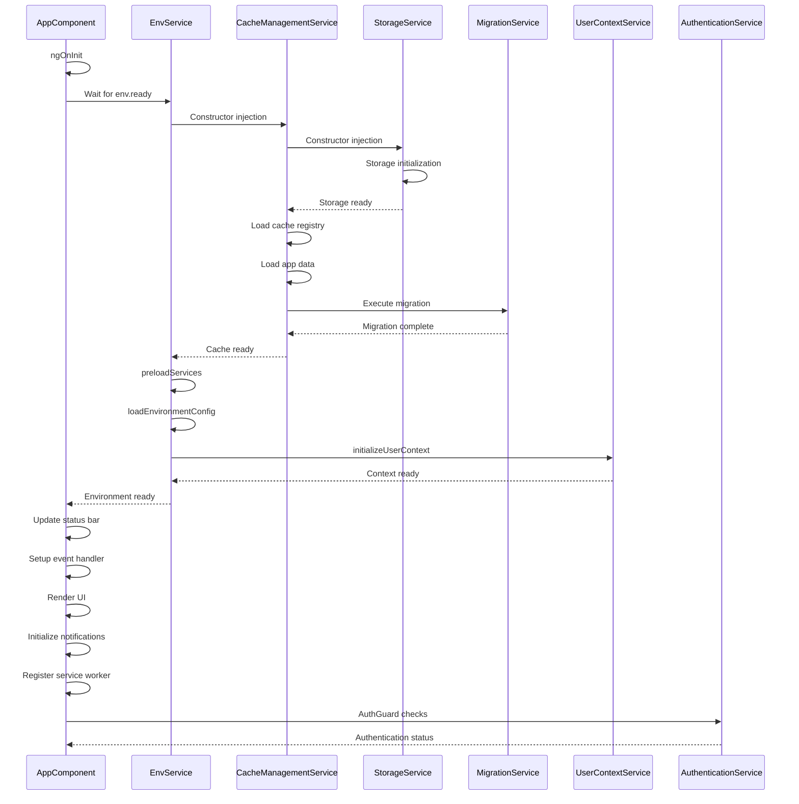

# App Component & EnvService Initialization Flow

## 🏗️ **App Component & EnvService Initialization Flow**

```mermaid
flowchart TD
    AppStart([App starts]) --> AppComponent[AppComponent ngOnInit]
    AppComponent --> InitializeApp[initializeApp method]
    InitializeApp --> WaitEnv[Wait for env.ready]
    WaitEnv --> EnvService[EnvService constructor]

    EnvService --> CacheService[CacheManagementService constructor]
    CacheService --> StorageService[StorageService constructor]
    StorageService --> StorageInit[Storage initialization]
    StorageInit --> CacheInit[Cache initialization]
    CacheInit --> LoadCache[Load cache registry]
    LoadCache --> LoadAppData[Load app data from cache]
    LoadAppData --> Migration[Execute migration]
    Migration --> CacheReady[Cache ready signal]

    CacheReady --> EnvPreload[EnvService preloadServices]
    EnvPreload --> LoadEnvConfig[Load environment config]
    LoadEnvConfig --> InitUserContext[Initialize user context]
    InitUserContext --> EnvReady[EnvService ready signal]

    EnvReady --> UpdateStatusBar[Update status bar]
    UpdateStatusBar --> EventHandler[Setup event handler]
    EventHandler --> RenderUI[Render UI]
    RenderUI --> InitNotification[Initialize notifications]
    InitNotification --> ServiceWorker[Register service worker]
    ServiceWorker --> AppReady[App ready]

    AppReady --> AuthGuard[AuthGuard checks]
    AuthGuard -->|Authenticated| MainApp[Main App]
    AuthGuard -->|Not authenticated| LoginPage[Login Page]
```

## 🔄 **Service Initialization Sequence**

## 📋 **Services Involved**

### **Core Services**

- **AppComponent** (`src/app/app.component.ts`)
- **EnvService** (`src/app/services/core/env.service.ts`)
- **CacheManagementService** (`src/app/services/core/cache-management.service.ts`)
- **StorageService** (`src/app/services/core/storage.service.ts`)
- **MigrationService** (`src/app/services/core/migration.service.ts`)

### **Supporting Services**

- **UserContextService** (`src/app/services/auth/user-context.service.ts`)
- **AuthenticationService** (`src/app/services/auth/authentication.service.ts`)
- **AuthGuard** (`src/app/guards/app.guard.ts`)
