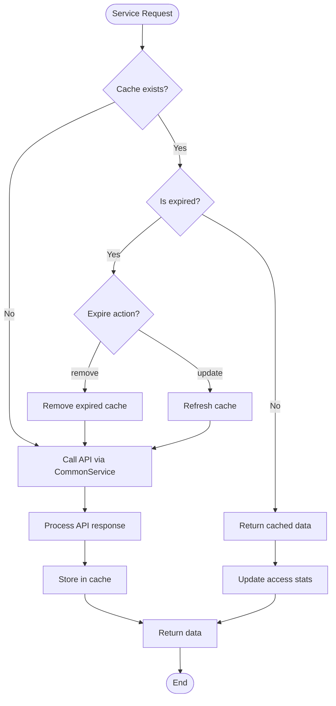
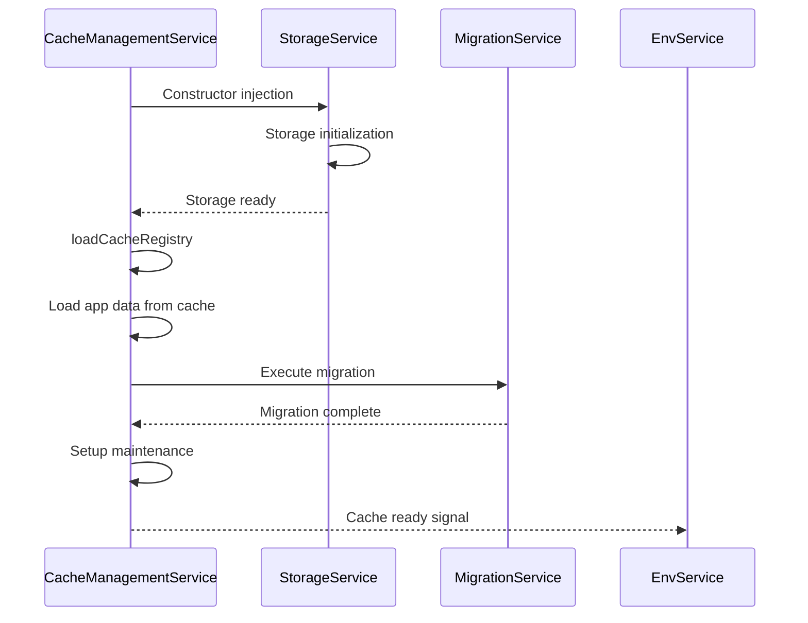
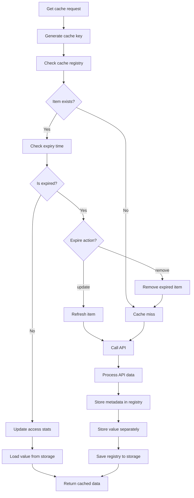
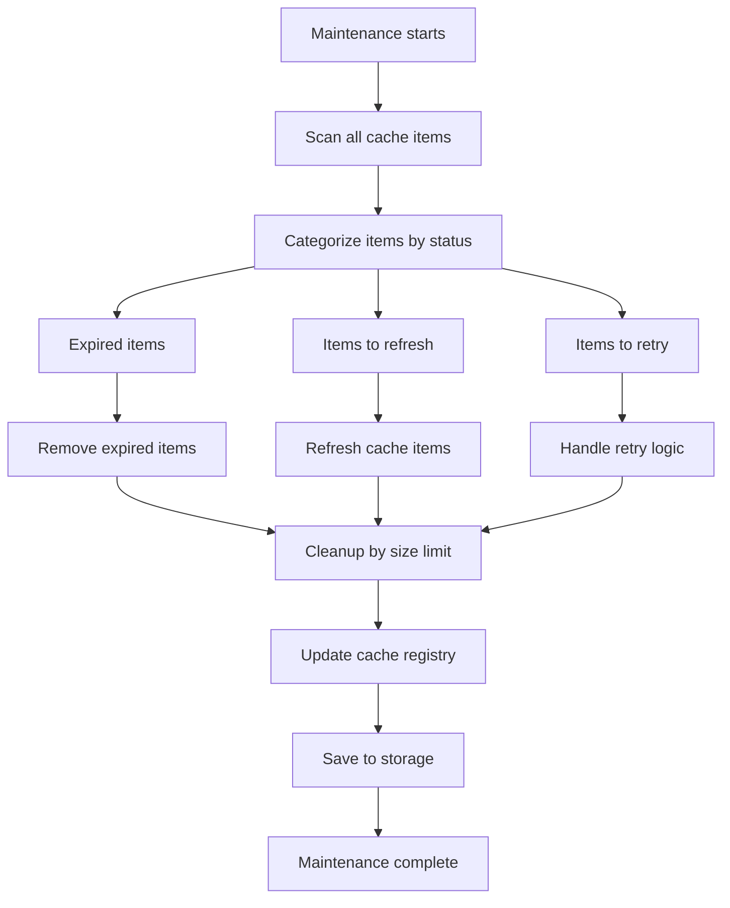
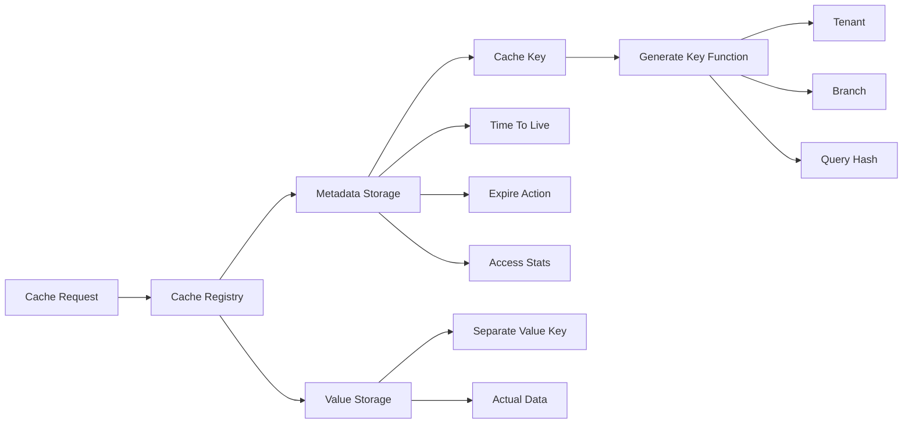
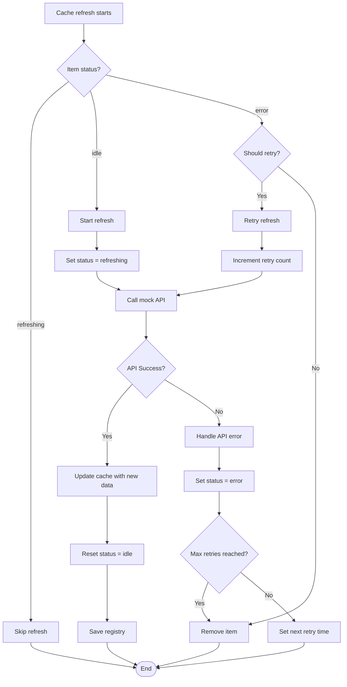

# Cache Management Flow Documentation

## 🗄️ **Cache Management Flow Overview**

This document describes the cache management system in ART-ERP-FE, focusing on CacheManagementService operations and storage architecture.

## 📋 **Services Involved**

### **Core Cache Services**
- **CacheManagementService** (`src/app/services/core/cache-management.service.ts`)
- **StorageService** (`src/app/services/core/storage.service.ts`)
- **MigrationService** (`src/app/services/core/migration.service.ts`)

### **Supporting Services**
- **EnvService** (`src/app/services/core/env.service.ts`)

## 🔄 **Cache Management Flow Diagram**



## 🔄 **Cache Initialization Sequence**



## 🔄 **Cache Operations Flow**



## 🔄 **Cache Maintenance Flow**



## 🔄 **Cache Storage Architecture**



## 🔄 **Cache Refresh Flow**



## 📊 **Cache Configuration**

### **Default Cache Config**
```typescript
{
    enable: true,
    timeToLive: 1, // 1 hour
    expireAction: 'remove',
    maintenanceInterval: 1, // 1 hour
    autoRefresh: true,
    retryConfig: {
        maxRetries: 3,
        retryInterval: 5, // 5 minutes
    },
    valueKey: 'Cache_',
}
```

### **Cache Key Structure**
```
[key].[branch].[tenant].[queryHash]
```

### **Storage Separation**
- **Metadata**: Stored in CacheRegistry
- **Values**: Stored separately with `Cache_` prefix

## 🔧 **Cache Operations**

### **Get Operation**
1. Generate cache key
2. Check registry for metadata
3. Verify expiry time
4. Load value from separate storage
5. Update access statistics

### **Set Operation**
1. Generate cache key
2. Create metadata object
3. Store metadata in registry
4. Store value separately
5. Save registry to storage

### **Remove Operation**
1. Generate cache key
2. Remove from registry
3. Remove value from storage
4. Update registry

### **Clear Operation**
1. Clear all or tenant/branch specific
2. Remove all values from storage
3. Clear registry
4. Save updated registry

## 🚀 **Best Practices**

### **Performance**
- Separate metadata and value storage
- Efficient key generation with hash
- Lazy loading of values
- Automatic maintenance

### **Reliability**
- Retry mechanism for failed refreshes
- Error handling and recovery
- Migration support
- Size limit cleanup

### **Scalability**
- Tenant and branch isolation
- Configurable TTL and retry settings
- Maintenance automation
- Statistics tracking

---

**Last Updated**: December 2024
**Version**: 1.0.0
**Maintained by**: Development Team