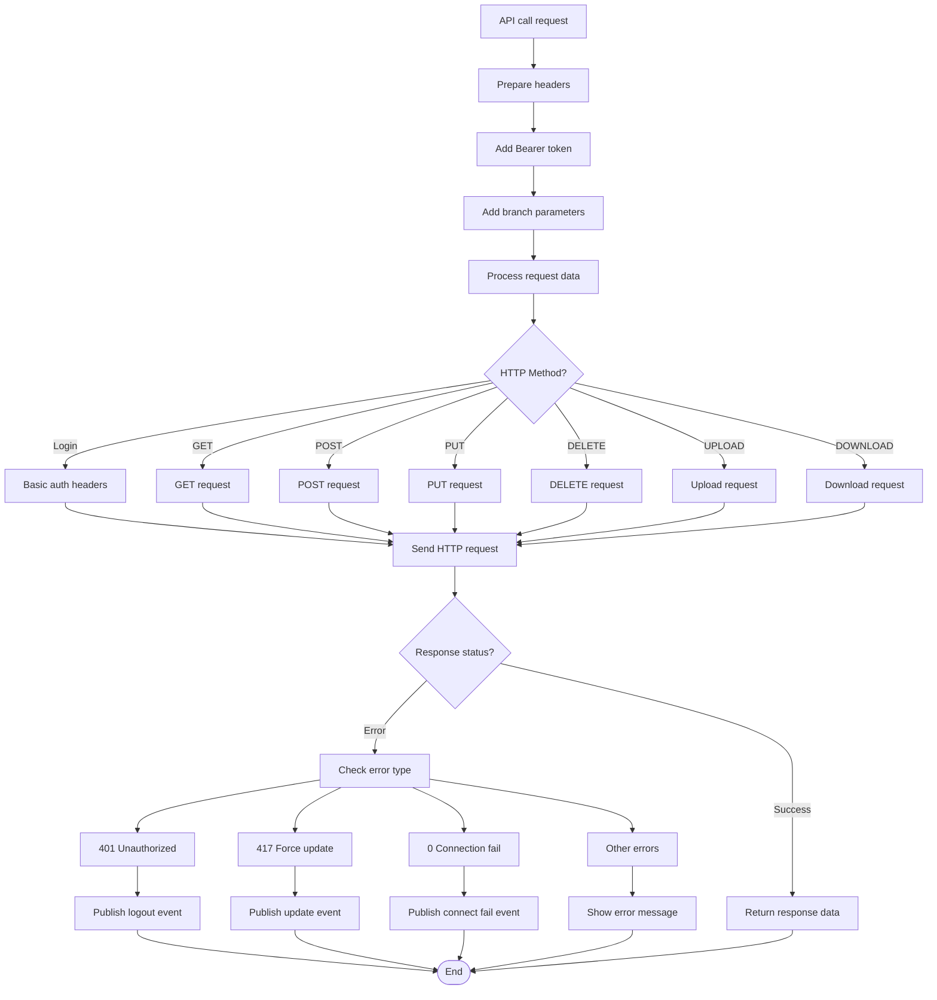
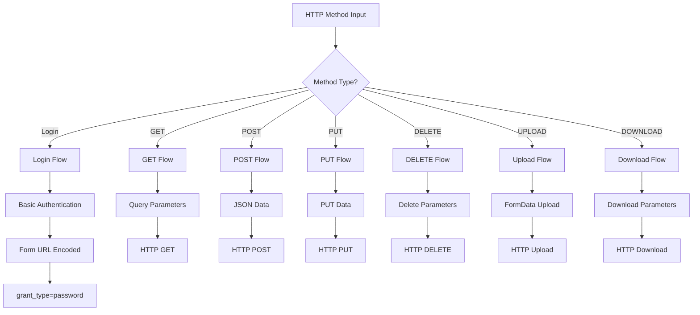
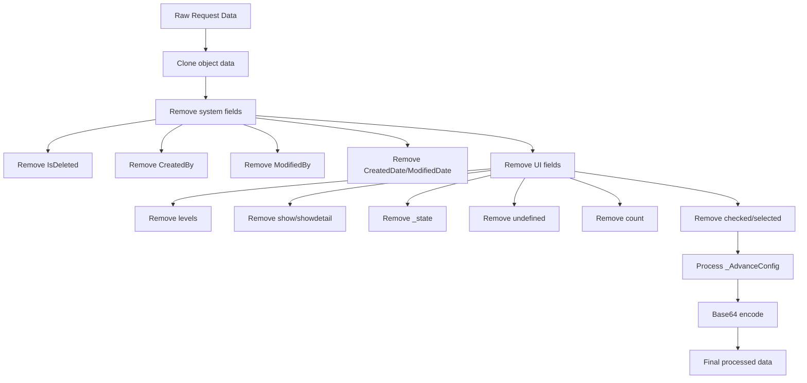
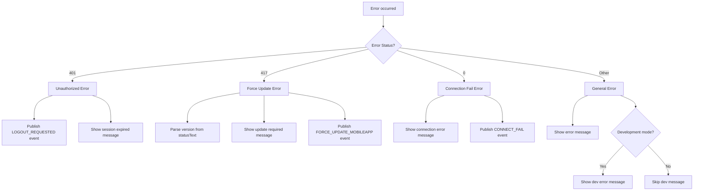
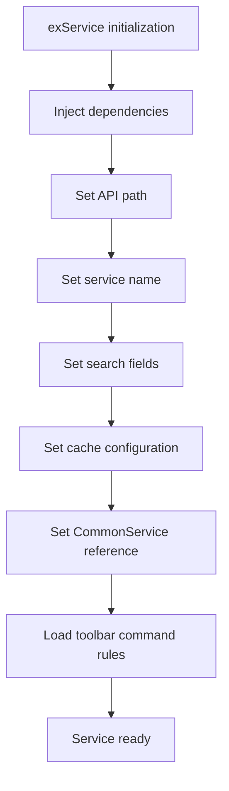
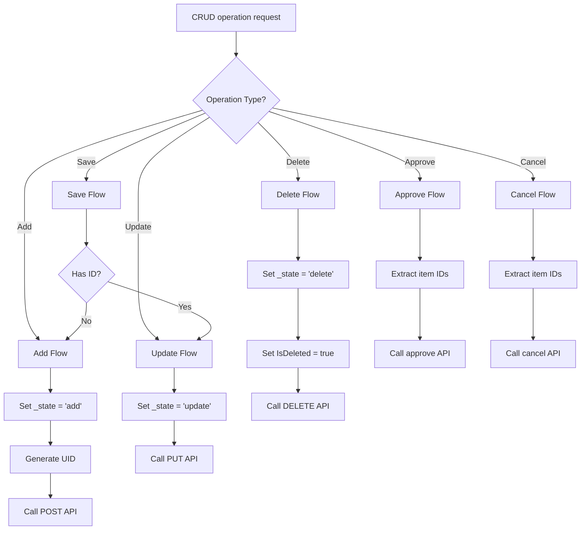
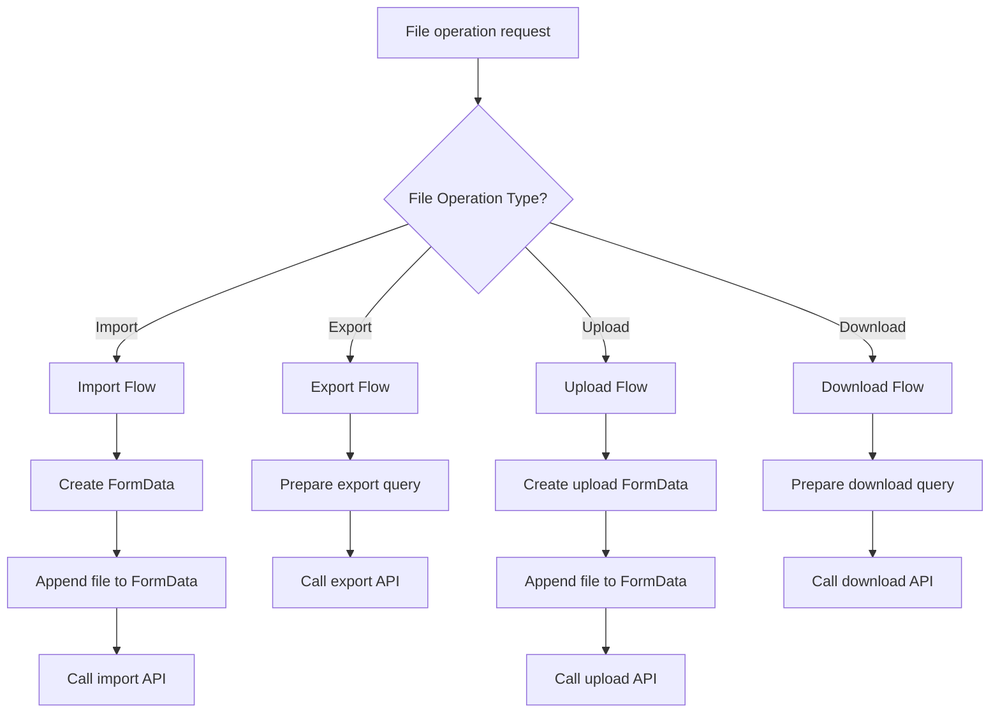

# Common Service Flow Documentation

## 🌐 **Common Service Flow Overview**

This document describes the CommonService API communication flow in ART-ERP-FE, including HTTP methods, error handling, and data processing.

## 📋 **Services Involved**

### **Core Services**
- **CommonService** (`src/app/services/core/common.service.ts`)
- **exService** (`src/app/services/core/common.service.ts`)
- **EnvService** (`src/app/services/core/env.service.ts`)

### **Supporting Services**
- **HttpClient** (Angular HTTP Client)
- **ApiSetting** (`src/app/services/static/api-setting.ts`)

## 🔄 **CommonService API Flow**



## 🔄 **HTTP Method Processing Flow**



## 🔄 **Data Processing Flow**



## 🔄 **Error Handling Flow**



## 🔄 **exService Provider Flow**



## 🔄 **CRUD Operations Flow**



## 🔄 **File Operations Flow**



## 📊 **API Configuration**

### **Headers Configuration**
```typescript
{
    Authorization: 'Bearer ' + token,
    'Content-Type': 'application/json',
    'Data-type': 'json',
    'App-Version': environment.appVersion
}
```

### **Login Headers**
```typescript
{
    'Content-Type': 'application/x-www-form-urlencoded',
    'App-Version': environment.appVersion,
    Authorization: 'Basic ' + btoa(username + ':' + password)
}
```

### **Upload Headers**
```typescript
{
    Authorization: 'Bearer ' + token,
    'App-Version': environment.appVersion,
    withCredentials: 'true'
}
```

## 🔧 **URL Processing**

### **URL Construction**
1. Check if URL starts with 'http'
2. Use ApiSetting for domain resolution
3. Add branch parameters if needed
4. Add query parameters for GET requests

### **Branch Parameters**
- **IDBranch**: Added automatically if not present
- **SelectedBranch**: Added for branch-specific operations

## 🚀 **Best Practices**

### **Security**
- Bearer token authentication
- Basic auth for login
- Secure file upload handling

### **Performance**
- Data cloning to prevent mutations
- Efficient parameter processing
- Proper error handling

### **Reliability**
- Comprehensive error handling
- Event publishing for critical errors
- Development mode debugging

---

**Last Updated**: December 2024
**Version**: 1.0.0
**Maintained by**: Development Team
