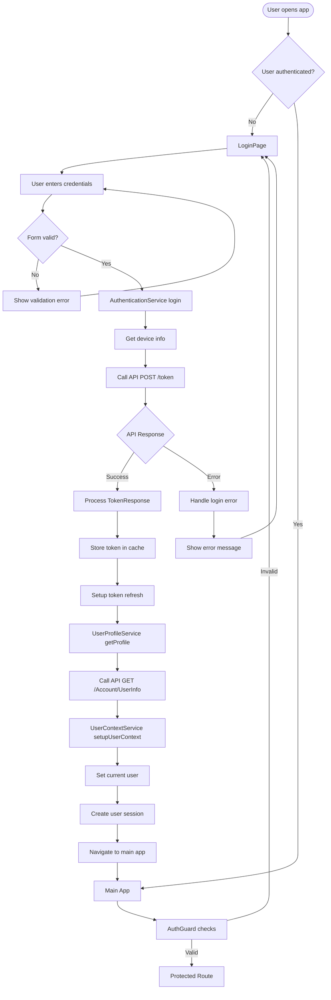
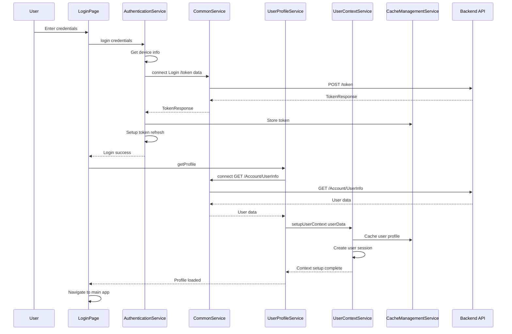

# Login Flow Documentation - ART-ERP-FE

## 🔄 **Login Flow Diagram**

```mermaid
flowchart TD
    Start([User opens app]) --> CheckAuth{User authenticated?}
    CheckAuth -->|No| LoginPage[LoginPage]
    CheckAuth -->|Yes| App[Main App]
    
    LoginPage --> Form[User enters credentials]
    Form --> Validate{Form valid?}
    Validate -->|No| ShowError[Show validation error]
    Validate -->|Yes| AuthService[AuthenticationService login]
    
    AuthService --> GetDevice[Get device info]
    GetDevice --> CallAPI[Call API POST /token]
    CallAPI --> APIResponse{API Response}
    
    APIResponse -->|Success| ProcessToken[Process TokenResponse]
    APIResponse -->|Error| HandleError[Handle login error]
    
    ProcessToken --> StoreToken[Store token in cache]
    StoreToken --> SetupRefresh[Setup token refresh]
    SetupRefresh --> LoadProfile[UserProfileService getProfile]
    
    LoadProfile --> GetUserData[Call API GET /Account/UserInfo]
    GetUserData --> SetupContext[UserContextService setupUserContext]
    SetupContext --> SetUser[Set current user]
    SetUser --> CreateSession[Create user session]
    CreateSession --> Navigate[Navigate to main app]
    
    HandleError --> ShowErrorMsg[Show error message]
    ShowErrorMsg --> LoginPage
    
    Navigate --> App
    ShowError --> Form
    
    App --> AuthGuard[AuthGuard checks]
    AuthGuard -->|Valid| ProtectedRoute[Protected Route]
    AuthGuard -->|Invalid| LoginPage
```

## 🔄 **Service Interaction Diagram**

```mermaid
sequenceDiagram
    participant U as User
    participant LP as LoginPage
    participant AS as AuthenticationService
    participant CS as CommonService
    participant UPS as UserProfileService
    participant UCS as UserContextService
    participant CMS as CacheManagementService
    participant API as Backend API
    
    U->>LP: Enter credentials
    LP->>AS: login credentials
    AS->>AS: Get device info
    AS->>CS: connect Login /token data
    CS->>API: POST /token
    API-->>CS: TokenResponse
    CS-->>AS: TokenResponse
    AS->>CMS: Store token
    AS->>AS: Setup token refresh
    AS-->>LP: Login success
    LP->>UPS: getProfile
    UPS->>CS: connect GET /Account/UserInfo
    CS->>API: GET /Account/UserInfo
    API-->>CS: User data
    CS-->>UPS: User data
    UPS->>UCS: setupUserContext userData
    UCS->>CMS: Cache user profile
    UCS->>UCS: Create user session
    UCS-->>UPS: Context setup complete
    UPS-->>LP: Profile loaded
    LP->>LP: Navigate to main app
```