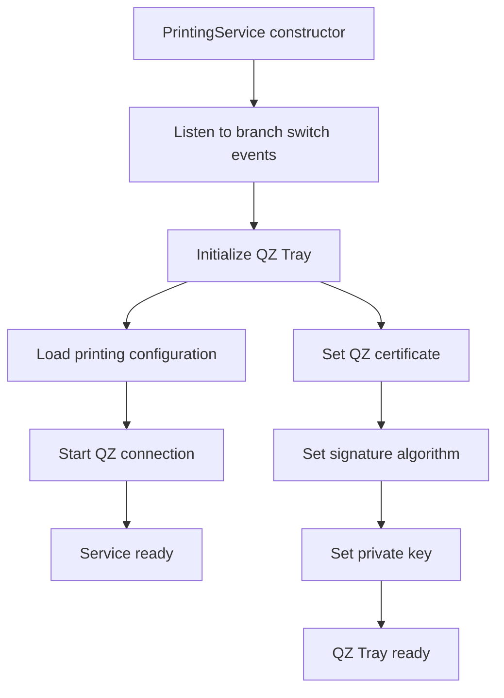
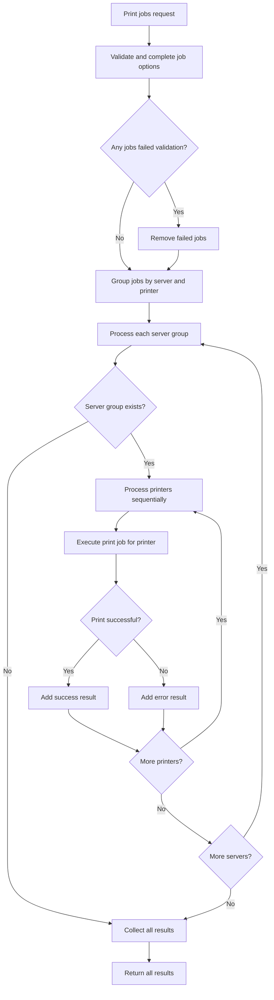
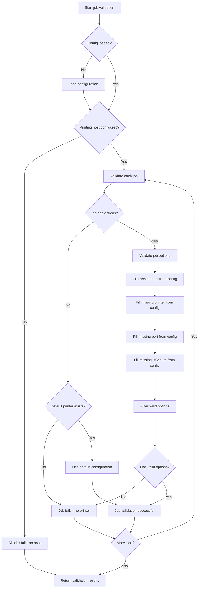
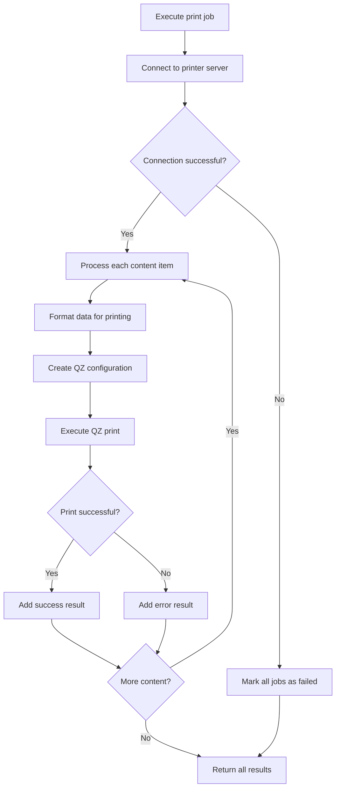
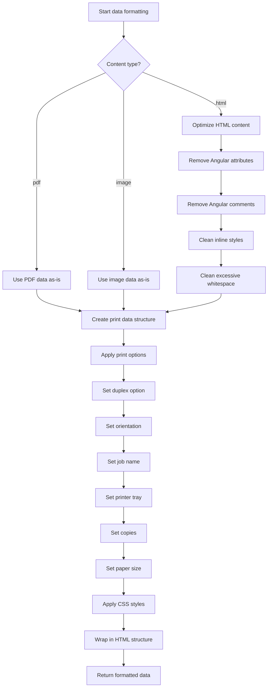
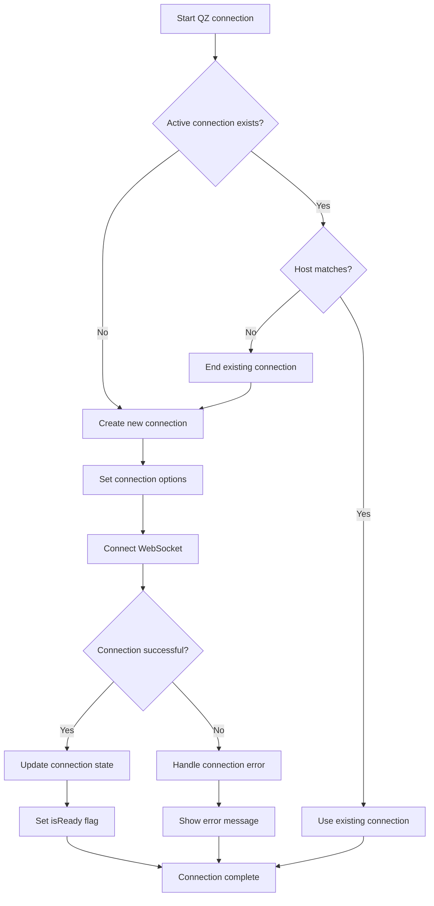
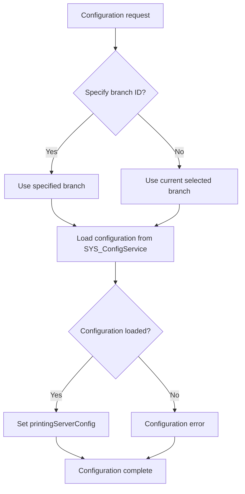
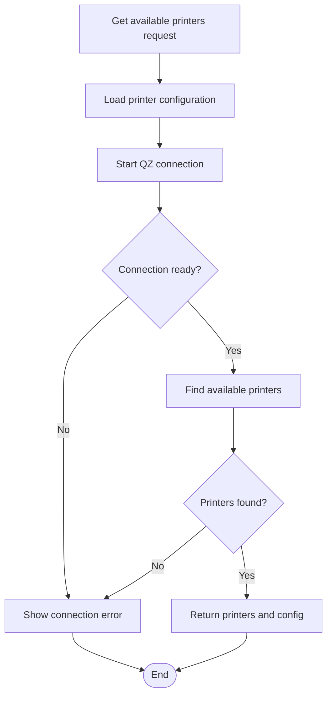

# Printing Service Flow Documentation

## 🖨️ **Printing Service Flow Overview**

This document describes the PrintingService flow in ART-ERP-FE, including QZ Tray integration, print job processing, and printer management.

## 📋 **Services Involved**

### **Core Services**
- **PrintingService** (`src/app/services/util/printing.service.ts`)
- **EnvService** (`src/app/services/core/env.service.ts`)
- **SYS_ConfigService** (`src/app/services/custom/system-config.service.ts`)

### **Supporting Services**
- **SYS_PrinterProvider** (`src/app/services/static/services.service.ts`)
- **QZ Tray** (External printing library)

## 🔄 **Printing Service Initialization Flow**



## 🔄 **Print Job Processing Flow**



## 🔄 **Job Validation Flow**



## 🔄 **Print Job Execution Flow**



## 🔄 **Data Formatting Flow**



## 🔄 **QZ Tray Connection Flow**



## 🔄 **Configuration Loading Flow**



## 🔄 **Available Printers Flow**



## 📊 **Print Data Structure**

### **printData Interface**
```typescript
{
    content: string,           // HTML/PDF/Image content
    type: 'html' | 'pdf' | 'image',
    options?: printOptions[],  // Printer options array
    IDJob?: string            // Job identifier
}
```

### **printOptions Interface**
```typescript
{
    printer?: string,         // Printer name/code
    host?: string,           // Printer server host
    port?: string,           // Printer server port
    isSecure?: boolean,      // Use secure connection
    jobName?: string,        // Print job name
    tray?: string,           // Printer tray
    pages?: string,          // Page range
    copies?: number,         // Number of copies
    paperSize?: string,      // Paper size configuration
    rotation?: number,       // Rotation angle
    scale?: number,          // Scale factor
    duplex?: string,         // Duplex mode
    orientation?: string,    // Page orientation
    cssStyle?: string,       // Custom CSS
    autoStyle?: Element      // Auto style element
}
```

### **Printing Server Configuration**
```typescript
{
    PrintingHost: string,      // Default printing host
    PrintingPort: number,      // Default printing port
    PrintingIsSecure: boolean, // Use secure connection
    DefaultPrinter: string     // Default printer code
}
```

## 🔧 **QZ Tray Integration**

### **Security Configuration**
- **Certificate**: Hardcoded ERP signing certificate
- **Private Key**: RSA private key for signing
- **Signature Algorithm**: SHA512withRSA
- **Connection**: WebSocket with optional SSL

### **Print Data Format**
```typescript
{
    data: [{
        type: 'pixel',
        format: 'html' | 'pdf' | 'image',
        flavor: 'file' | 'plain',
        data: string
    }],
    options: {
        duplex?: string,
        orientation?: string,
        jobName?: string,
        printerTray?: string,
        copies?: number,
        size?: object,
        units?: string
    }
}
```

## 🚀 **Best Practices**

### **Performance**
- Group jobs by server and printer for efficiency
- Process printers sequentially to avoid conflicts
- Optimize HTML content before printing
- Use connection pooling for multiple jobs

### **Error Handling**
- Validate all job options before processing
- Handle connection failures gracefully
- Provide meaningful error messages
- Track job status and results

### **Configuration**
- Load configuration per branch
- Support both default and custom printer settings
- Handle missing configuration gracefully
- Update configuration on branch switch

### **Security**
- Use secure connections when possible
- Validate all input data
- Handle certificate errors properly
- Implement proper error logging

---

**Last Updated**: December 2024
**Version**: 1.0.0
**Maintained by**: Development Team
