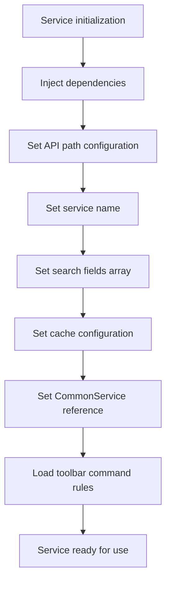
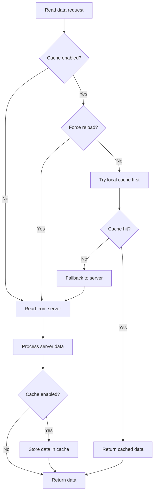
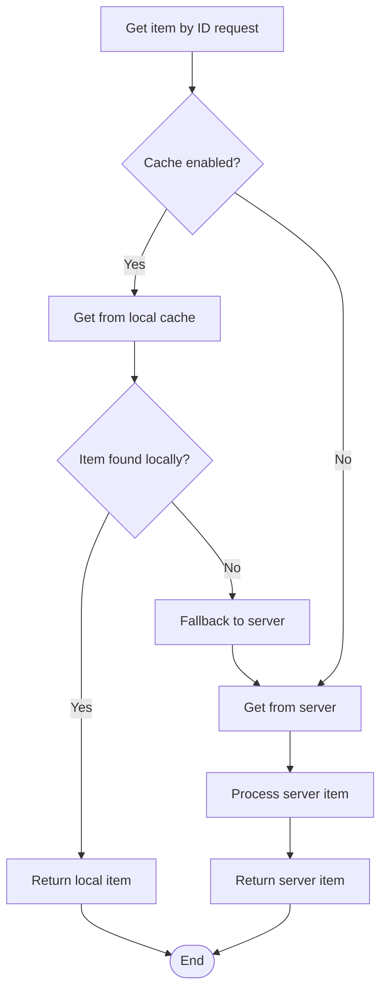
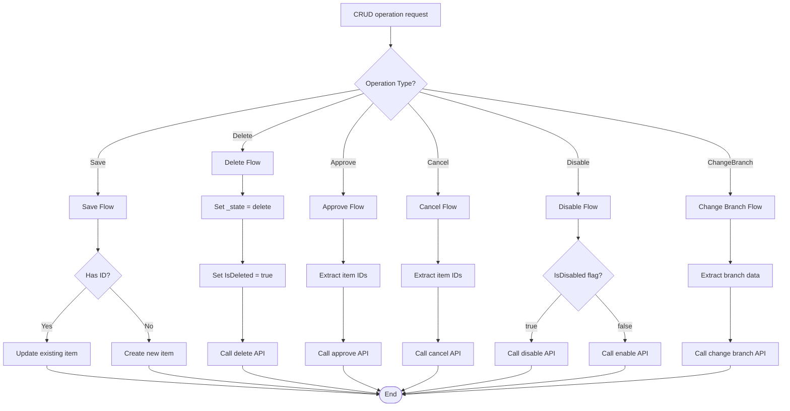
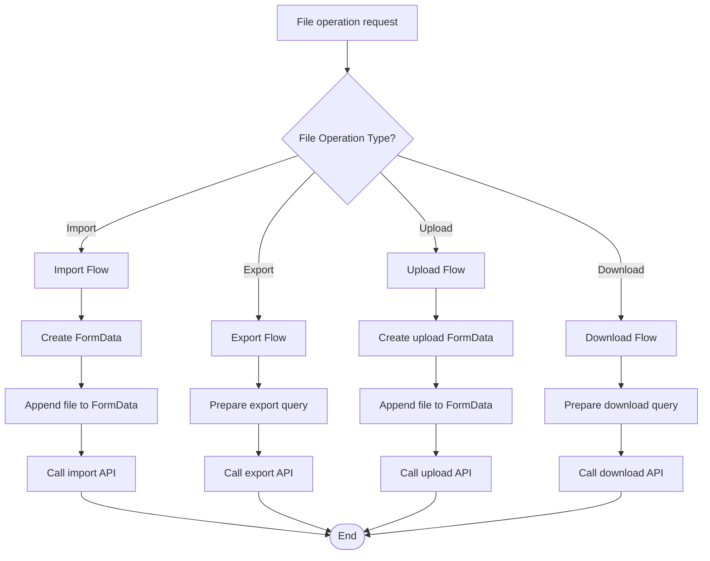
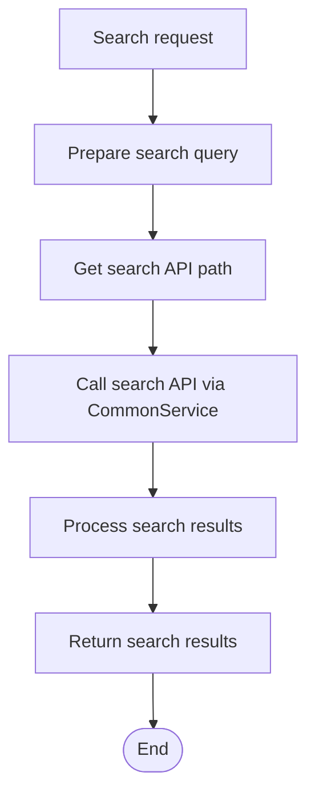
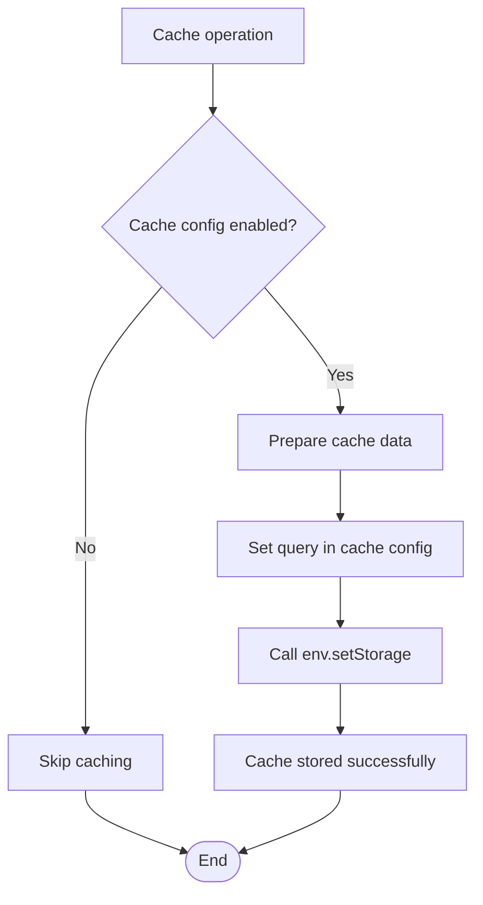
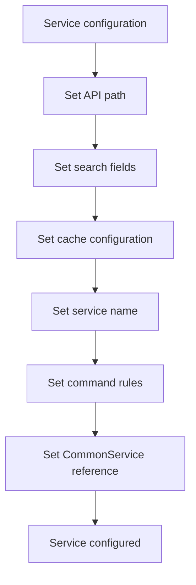

# Provider Service Flow Documentation

## 🔧 **Provider Service Flow Overview**

This document describes the providerService (ExtendService) flow in ART-ERP-FE, including CRUD operations, caching, and data access patterns.

## 📋 **Services Involved**

### **Core Services**
- **providerService** (`src/app/services/core/extend-service.ts`)
- **CommonService** (`src/app/services/core/common.service.ts`)
- **EnvService** (`src/app/services/core/env.service.ts`)

### **Supporting Services**
- **CacheManagementService** (`src/app/services/core/cache-management.service.ts`)
- **exService** (`src/app/services/core/common.service.ts`)

## 🔄 **Provider Service Initialization Flow**



## 🔄 **Data Reading Flow**



## 🔄 **Single Item Retrieval Flow**



## 🔄 **CRUD Operations Flow**



## 🔄 **File Operations Flow**



## 🔄 **Search Operation Flow**



## 🔄 **Cache Integration Flow**



## 🔄 **Service Configuration Flow**



## 📊 **Service Properties**

### **Core Properties**
```typescript
{
    apiPath: any,           // API path configuration
    searchField: [],       // Fields to search in
    allowCache: true,      // Enable/disable caching
    serviceName: '',       // Service identifier
    commonService: CommonService, // CommonService reference
    showCommandRules: [],  // UI command rules
    cacheConfig: CacheConfig // Cache configuration
}
```

### **API Path Structure**
```typescript
{
    getList: { method: 'GET', url: () => 'api/endpoint' },
    getItem: { method: 'GET', url: (id) => `api/endpoint/${id}` },
    postItem: { method: 'POST', url: () => 'api/endpoint' },
    putItem: { method: 'PUT', url: (id) => `api/endpoint/${id}` },
    delItem: { method: 'DELETE', url: (ids) => `api/endpoint/${ids}` },
    getSearchList: { method: 'GET', url: () => 'api/search' }
}
```

## 🔧 **Method Categories**

### **Read Operations**
- `read(query, forceReload)` - Read with caching
- `readServer(query)` - Read from server only
- `getAnItem(Id, UID)` - Get single item
- `search(query)` - Search operation

### **Write Operations**
- `save(item, isForceCreate)` - Save/create item
- `delete(items)` - Delete items
- `disable(items, IsDisabled)` - Enable/disable items

### **Workflow Operations**
- `submitForApproval(items)` - Submit for approval
- `approve(items)` - Approve items
- `disapprove(items)` - Disapprove items
- `cancel(items)` - Cancel items

### **File Operations**
- `import(fileToUpload)` - Import from file
- `export(query)` - Export data
- `upload(fileToUpload)` - Upload file
- `download(query)` - Download data

### **Utility Operations**
- `changeBranch(item)` - Change item branch

## 🚀 **Best Practices**

### **Service Design**
- Extend providerService for consistent interface
- Configure API paths properly
- Set appropriate cache configurations
- Use meaningful service names

### **Caching Strategy**
- Enable cache for frequently accessed data
- Use forceReload for critical updates
- Configure appropriate TTL values
- Handle cache misses gracefully

### **Error Handling**
- Leverage CommonService error handling
- Provide meaningful error messages
- Handle network failures appropriately

### **Performance**
- Use local cache when possible
- Implement proper search fields
- Optimize API calls
- Use pagination for large datasets

---

**Last Updated**: December 2024
**Version**: 1.0.0
**Maintained by**: Development Team
